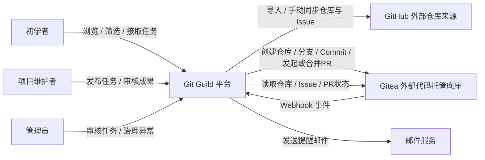
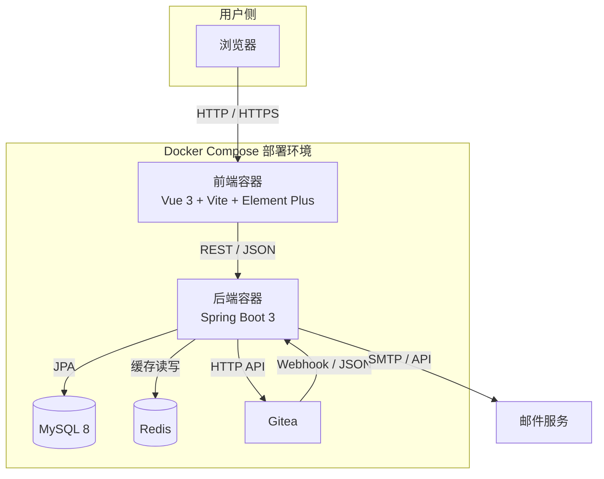
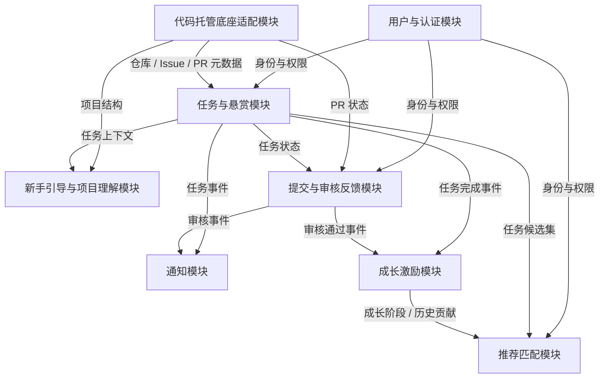
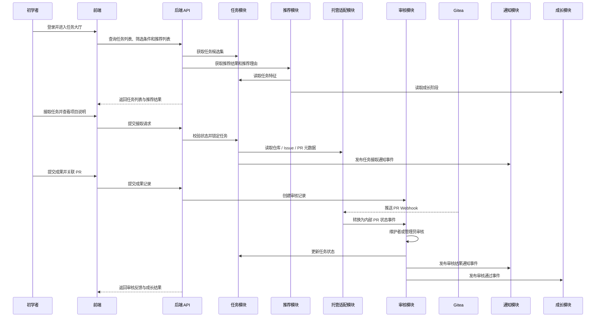

# Git Guild 架构设计文档

## 1. 文档目的

本文件整合 Git Guild 在 P2 阶段形成的架构设计成果，明确系统总体结构、模块划分、模块接口、技术选型与关键架构决策，为后续实现与演进提供统一依据。

## 2. 架构目标与设计原则

### 2.1 架构目标

- 在 10 周课程项目约束下，优先保证核心业务闭环可实现
- 支持初学者与维护者两类核心角色的协作流程
- 将推荐系统纳入核心业务，而非后续附加能力
- 借助外部代码托管底座复用仓库、Issue、PR 与 Webhook 能力
- 在不引入微服务复杂度的前提下，为后续演进保留清晰边界

### 2.2 设计原则

- 前后端分离
- 后端采用模块化单体架构
- 业务模块按职责边界划分
- 统一通过 REST API 对前端提供服务
- 通过 Webhook 与应用内事件解耦跨模块流程
- 平台自有账号体系，不依赖 GitHub OAuth

## 3. 总体架构概览

Git Guild 采用“前后端分离 + 模块化单体 + 外部代码托管底座集成”的总体架构。

- 前端：Vue 3 单页应用，负责任务大厅、推荐结果、审核反馈、成长记录等页面交互
- 后端：Spring Boot 3 单体应用，内部按领域模块组织
- 数据库：MySQL，负责持久化用户、任务、审核、成长等核心业务数据
- 缓存：Redis，负责热点任务、推荐结果缓存、排行榜等高频读取场景
- 外部代码托管底座：Gitea，支持从 GitHub 导入仓库，负责仓库、Issue、PR、Webhook 等代码协作基础能力
- 通知通道：站内通知 + 邮件通知

## 4. 系统上下文图

### 4.1 上下文说明

- 初学者主要使用任务大厅、推荐列表、新手引导、成果提交和成长反馈能力。
- 维护者主要使用任务发布、任务管理、成果审核和反馈能力。
- 管理员主要使用任务审核、异常处理、任务上下架和平台治理能力。
- GitHub 作为外部项目来源，主要用于导入仓库、同步 Issue 与同步 PR 状态。
- Gitea 是平台内代码协作的运行底座，负责仓库、Issue、PR、分支和 Webhook 等基础代码托管能力。
- Git Guild 的核心价值集中在任务协作、推荐匹配、审核反馈、成长激励和平台治理。

## 5. 容器与部署架构图

### 5.1 容器职责说明

| 容器    | 职责                                  |
| ----- | ----------------------------------- |
| 前端容器  | 提供任务大厅、推荐列表、任务详情、审核页面、成长页面和管理页面     |
| 后端容器  | 承载平台核心业务、权限校验、模块编排、外部集成和事件处理        |
| MySQL | 持久化用户、任务、推荐记录、审核记录、通知记录和成长数据        |
| Redis | 缓存热点任务、推荐结果、通知计数和排行榜等高频读取数据         |
| Gitea | 提供仓库、Issue、PR、分支和 Webhook 等代码托管基础能力 |

## 6. 后端模块划分

后端划分为 8 个业务模块。这里的 P0 / P1 / P2 表示实现优先级，不表示课程阶段。

| 模块          | 优先级 | 核心职责                                                      | 职责边界                             |
| ----------- | --- | --------------------------------------------------------- | -------------------------------- |
| 用户与认证模块     | P0  | 注册登录、用户资料、角色管理、权限控制                                       | 负责“谁可以做什么”，不负责任务规则和推荐计算          |
| 代码托管底座适配模块  | P0  | 对接 GitHub 与 Gitea，支持仓库导入/同步、分支、commit、Issue、PR，接收 Webhook | 只封装外部托管能力，不实现 Git 底层仓库管理         |
| 任务与悬赏模块     | P0  | 任务发布、分类、标签、筛选、接取、状态流转、上下架                                 | 负责任务主数据和任务流程，不负责推荐算法和审核意见流转      |
| 推荐匹配模块      | P0  | 任务推荐、贡献者推荐、推荐理由、推荐排序                                      | 负责系统主动推荐，不替代用户主动筛选，不修改任务状态       |
| 提交与审核反馈模块   | P0  | 成果关联、维护者审核、管理员审核、审核意见、退回修改                                | 负责成果如何被判定，不负责仓库 PR 底层能力          |
| 新手引导与项目理解模块 | P0  | 任务模板、项目结构说明、贡献流程、运行说明、示例 PR                               | 负责降低新手理解成本，不负责任务状态流转             |
| 通知模块        | P0  | 站内通知、邮件通知、审核提醒、超时提醒、通知汇总                                  | 负责消息触达，不做业务决策                    |
| 成长激励模块      | P1  | XP、等级、贡献记录、徽章、排行榜                                         | P1 先实现 XP、等级、贡献记录；P2 再实现徽章和排行榜增强 |

### 6.1 优先级说明

P0 必须覆盖完整核心闭环：

- 用户登录或注册。
- 浏览、分类、筛选和接取任务。
- 获取系统推荐任务和推荐理由。
- 查看任务说明、项目结构和完成标准。
- 提交成果并关联 PR 或提交记录。
- 维护者或管理员审核成果与任务内容。
- 接收通知并看到基础成长反馈。

P1 重点增强体验和效率：

- XP、等级和贡献记录。
- 推荐规则增强。
- 审核 SLA 与超时提醒。
- 用户中心和通知偏好。

P2 可后置实现：

- 徽章和排行榜增强。
- 导师模式。
- 社区互动。
- 高级推荐策略。
- 运营统计看板。

## 7. 后端模块依赖图

### 7.1 模块关系说明

- 用户与认证模块提供身份、角色和权限上下文。
- 代码托管底座适配模块是外部系统访问边界，其他模块不得直接调用 GitHub 或 Gitea。
- 任务与悬赏模块是系统主业务中枢，负责任务主数据和状态流转。
- 推荐匹配模块只读取用户、任务和成长特征，输出推荐结果和推荐理由。
- 提交与审核反馈模块负责维护者审核和管理员审核，是成果判定与治理动作的归口。
- 通知模块由业务事件触发，不反向决定业务状态。
- 成长激励模块订阅任务完成和审核通过事件，更新成长数据。

## 8. 模块职责与接口定义

### 8.1 模块职责摘要

| 模块          | 核心职责                                     | 主要输出             |
| ----------- | ---------------------------------------- | ---------------- |
| 用户与认证模块     | 注册登录、角色管理、权限控制                           | 用户身份、角色、权限上下文    |
| 代码托管底座适配模块  | 仓库导入/同步、分支、commit、Issue/PR 同步、Webhook 接收 | 仓库元数据、PR 状态、外部事件 |
| 任务与悬赏模块     | 任务发布、分类、筛选、状态流转                          | 任务列表、任务详情、任务状态   |
| 推荐匹配模块      | 任务推荐、贡献者推荐、推荐理由                          | 推荐结果、推荐原因        |
| 提交与审核反馈模块   | 成果关联、审核意见、管理员审核                          | 审核状态、审核记录        |
| 新手引导与项目理解模块 | 项目结构说明、任务模板、流程指引                         | 指引内容、结构概览        |
| 通知模块        | 站内/邮件通知、汇总通知                             | 通知消息、投递记录        |
| 成长激励模块      | XP、等级、贡献记录、徽章、排行榜                        | 成长记录、等级变化        |

### 8.2 模块间接口定义

| 调用方 | 被调方 | 调用方式 | 数据格式 | 主要用途 |
| --- | --- | --- | --- | --- |
| 前端 | 后端统一 API | REST | JSON | 页面展示、表单提交、状态更新 |
| 代码托管底座适配模块 | GitHub | HTTP API | JSON | 导入 / 同步仓库、Issue 与 PR 状态 |
| 代码托管底座适配模块 | Gitea | HTTP API | JSON | 创建分支、提交 commit、发起/合并 PR，获取仓库、Issue、PR 元数据 |
| Gitea | 后端 Webhook 入口 | Webhook | JSON | 同步 PR、Issue、仓库事件 |
| 任务与悬赏模块 | 用户与认证模块 | 应用内服务调用 | DTO / Domain Object | 校验发布者、接取者与管理员权限 |
| 任务与悬赏模块 | 代码托管底座适配模块 | 应用内服务调用 | DTO | 读取仓库、Issue、PR 基础信息 |
| 推荐匹配模块 | 任务与悬赏模块 | 应用内服务调用 | DTO | 获取任务候选集与特征字段 |
| 推荐匹配模块 | 成长激励模块 | 应用内服务调用 | DTO | 获取成长阶段与历史贡献特征 |
| 提交与审核反馈模块 | 任务与悬赏模块 | 应用内服务调用 | DTO | 变更任务审核相关状态 |
| 提交与审核反馈模块 | 通知模块 | 应用内事件 / 服务调用 | Event / DTO | 发送审核结果与提醒通知 |
| 提交与审核反馈模块 | 成长激励模块 | 应用内事件 | Event | 审核通过后触发 XP 与成长更新 |

### 8.3 关键接口约束

- 前后端接口统一采用 REST + JSON。
- GitHub 到平台的同步采用单向策略，平台内协作状态以 Gitea 与 Git Guild 业务数据为准。
- 平台内 Git 操作通过 Gitea API 完成，支持创建分支、上传变更生成 commit、发起/合并 PR，不提供网页代码编辑器。
- 对外部底座的集成统一收敛在“代码托管底座适配模块”，其他模块不得直接访问 Gitea API。
- 审核通过、退回修改、任务关闭等关键状态变更必须由后端校验，不能只依赖前端限制。
- Webhook 处理必须考虑幂等、重复投递和事件顺序问题。
- 推荐模块只输出候选结果与排序，不直接修改任务与审核状态。
- 用户主动筛选属于任务模块能力；系统主动推荐属于推荐模块能力。

## 9. 核心业务流程

## 10. 技术选型说明

### 10.1 技术选型表

| 层次 | 选择 | 选择理由 |
| --- | --- | --- |
| 前端框架 | Vue 3 | 与当前仓库一致，组件化能力强，适合课程项目快速开发 |
| 前端构建工具 | Vite | 启动快、构建简单、与 Vue 3 生态配合成熟 |
| UI 组件库 | Element Plus | 文档成熟、适合后台与任务协作类界面快速搭建 |
| 后端框架 | Spring Boot 3 | 团队具备 Java 经验，生态成熟，便于构建模块化单体 |
| 数据访问 | Spring Data JPA | 与当前后端依赖一致，适合课程项目快速完成实体关系与 CRUD |
| 数据库 | MySQL 8 | 关系建模成熟，适合用户、任务、审核、成长等结构化数据 |
| 缓存中间件 | Redis | 适合推荐结果缓存、热点任务列表、排行榜等高频读取场景 |
| 外部代码托管底座 | Gitea | 轻量、可自托管、API/Webhook 完整，最适合 4 人 10 周课程项目 |
| 模块间通信 | REST + 应用内事件 | 保持实现简单，避免为微服务提前引入 MQ 和分布式治理 |
| 通知通道 | 站内通知 + 邮件 | 同时满足即时反馈与留痕需求 |
| 部署方式 | Docker Compose | 便于统一拉起前端、后端、MySQL、Redis 与 Gitea |

### 10.2 关键选型理由

#### 选择 Vue 3 + Vite

- 当前前端脚手架已基于 Vue 3 + Vite
- 对课程项目而言，迁移到其他前端框架没有明显收益
- 组件化与路由扩展能力足以支持任务大厅、个人主页和管理页面

#### 选择 Spring Boot 3

- 适合实现分层单体架构
- 对权限、参数校验、REST API 与事务处理支持成熟
- 团队已有 Java 后端经验，学习成本最低

#### 选择 Spring Data JPA

- 当前仓库已经声明 JPA 依赖，和现状一致
- 课程项目中大量实体关系可直接通过 ORM 快速落地
- 在任务生命周期、审核记录、成长数据等场景下，JPA 足以支撑实现

#### 选择 Gitea 作为外部代码托管底座

- 不需要自研 Git 仓库、Issue、PR 与 Webhook 基础能力
- 部署比 GitLab 更轻量，比自研方案风险更低
- 更符合“用最少基础设施成本完成核心业务”的课程目标

#### 选择 Redis

- 不是架构主干，但对热点列表和成长展示有明显性能收益
- 可为推荐缓存和排行榜提供低延迟读取能力

## 11. 风险与演进

### 11.1 当前风险

- 当前源码仍处于脚手架阶段，架构落地与文档存在实现差距
- 推荐系统作为核心能力，若规则设计不清晰，容易在实现阶段拖慢整体进度
- Gitea 集成虽能降低底层复杂度，但仍需处理 API 失败、Webhook 顺序与幂等问题
- JPA 简化了开发，但复杂筛选与统计查询可能需要额外优化

### 11.2 演进方向

- 在 P3/P4 可将推荐、通知或统计模块逐步拆分为独立服务
- 在功能稳定后再增强徽章、排行榜、导师模式与社区互动能力
- 在实现阶段补充统一 DTO、数据库迁移方案与接口文档

## 12. ADR 集合

本架构设计文档对应以下 ADR：

- [ADR-001：采用前后端分离的模块化单体架构](./ADR-001-采用前后端分离的模块化单体架构.md)
- [ADR-002：采用平台自有账号体系并集成 Gitea 作为外部代码托管底座](./ADR-002-采用平台自有账号体系并集成Gitea作为外部代码托管底座.md)
- [ADR-003：采用 REST + Webhook + 应用内事件的集成方式](./ADR-003-采用REST加Webhook加应用内事件的集成方式.md)

## 13. 小结

Git Guild 在 P2 阶段的架构设计应围绕“任务协作闭环 + 推荐匹配核心能力”展开。最终方案不是追求技术上限，而是在课程项目的时间、人力与学习成本约束下，选择可实现、可维护、可演进的总体结构。
