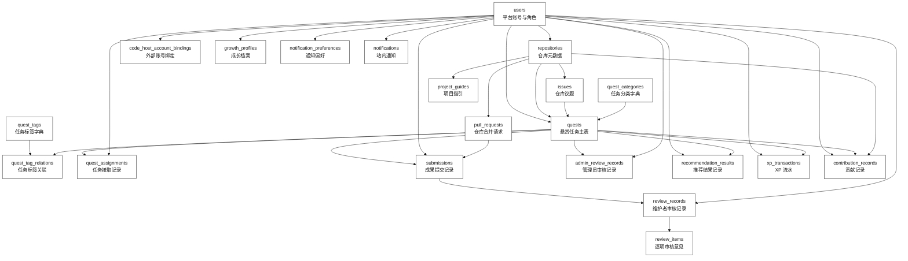

# Git Guild 数据库设计

## 1. 设计目标

本数据库设计面向 Git Guild P0 核心业务闭环：用户注册登录、仓库接入、任务发布与筛选、任务接取、成果提交、维护者审核、管理员审核、推荐匹配、新手引导、通知和基础成长反馈。

数据库采用 MySQL 8。Redis 只承担热点缓存和推荐结果短期缓存，不作为核心业务数据的最终存储。

## 2. ER 图

```mermaid
%%{init: {"theme": "base", "themeVariables": {"primaryColor": "#ffffff", "primaryTextColor": "#111111", "primaryBorderColor": "#111111", "lineColor": "#111111", "secondaryColor": "#f7f7f7", "tertiaryColor": "#ffffff"}}}%%
erDiagram
    users {
        BIGINT user_id PK
        VARCHAR username UK
        VARCHAR email UK
        VARCHAR password_hash
        VARCHAR role
        VARCHAR status
    }

    code_host_account_bindings {
        BIGINT binding_id PK
        BIGINT user_id FK
        VARCHAR host_type
        VARCHAR external_account_id
        VARCHAR status
    }

    repositories {
        BIGINT repository_id PK
        BIGINT owner_id FK
        VARCHAR name
        VARCHAR host_type
        VARCHAR source_url
        VARCHAR sync_status
    }

    issues {
        BIGINT issue_id PK
        BIGINT repository_id FK
        VARCHAR external_issue_id
        VARCHAR title
        VARCHAR status
    }

    pull_requests {
        BIGINT pull_request_id PK
        BIGINT repository_id FK
        VARCHAR external_pr_id
        VARCHAR status
        DATETIME merged_at
    }

    project_guides {
        BIGINT guide_id PK
        BIGINT repository_id FK
        TEXT project_structure
        TEXT run_instructions
        TEXT contribution_steps
    }

    quest_categories {
        BIGINT category_id PK
        VARCHAR name UK
        VARCHAR description
        BOOLEAN enabled
    }

    quest_tags {
        BIGINT tag_id PK
        VARCHAR name UK
        VARCHAR color
        BOOLEAN enabled
    }

    quests {
        BIGINT quest_id PK
        BIGINT publisher_id FK
        BIGINT repository_id FK
        BIGINT issue_id FK
        BIGINT category_id FK
        VARCHAR title
        VARCHAR status
        VARCHAR difficulty
        INT reward_xp
    }

    quest_tag_relations {
        BIGINT quest_id PK,FK
        BIGINT tag_id PK,FK
    }

    quest_assignments {
        BIGINT assignment_id PK
        BIGINT quest_id FK
        BIGINT assignee_id FK
        VARCHAR status
    }

    submissions {
        BIGINT submission_id PK
        BIGINT quest_id FK
        BIGINT submitter_id FK
        BIGINT pull_request_id FK
        VARCHAR status
    }

    review_records {
        BIGINT review_id PK
        BIGINT submission_id FK
        BIGINT reviewer_id FK
        VARCHAR decision
        VARCHAR summary
    }

    review_items {
        BIGINT item_id PK
        BIGINT review_id FK
        VARCHAR checkpoint
        VARCHAR comment
        BOOLEAN passed
    }

    admin_review_records {
        BIGINT admin_review_id PK
        BIGINT quest_id FK
        BIGINT admin_id FK
        VARCHAR decision
        VARCHAR reason
    }

    recommendation_results {
        BIGINT result_id PK
        BIGINT user_id FK
        BIGINT quest_id FK
        DECIMAL score
        VARCHAR reason_text
    }

    growth_profiles {
        BIGINT profile_id PK
        BIGINT user_id FK
        INT total_xp
        INT level
        INT completed_quest_count
    }

    xp_transactions {
        BIGINT transaction_id PK
        BIGINT user_id FK
        BIGINT quest_id FK
        INT amount
        VARCHAR reason
    }

    contribution_records {
        BIGINT record_id PK
        BIGINT user_id FK
        BIGINT quest_id FK
        BIGINT repository_id FK
        VARCHAR summary
    }

    notification_preferences {
        BIGINT preference_id PK
        BIGINT user_id FK
        BOOLEAN enable_email
        BOOLEAN enable_digest
    }

    notifications {
        BIGINT notification_id PK
        BIGINT receiver_id FK
        VARCHAR type
        VARCHAR status
        BIGINT related_id
    }

    users ||--o{ code_host_account_bindings : 绑定
    users ||--o{ quests : 发布
    users ||--o{ quest_assignments : 接取
    users ||--o{ submissions : 提交
    users ||--o{ review_records : 审核
    users ||--o{ admin_review_records : 管理
    users ||--|| growth_profiles : 拥有
    users ||--o{ xp_transactions : 获得
    users ||--o{ contribution_records : 贡献
    users ||--o{ recommendation_results : 接收
    users ||--o{ notifications : 接收通知
    users ||--|| notification_preferences : 配置偏好

    repositories ||--o{ issues : 包含
    repositories ||--o{ pull_requests : 包含
    repositories ||--|| project_guides : 拥有指引
    repositories ||--o{ quests : 支撑任务

    issues ||--o{ quests : 生成任务
    quest_categories ||--o{ quests : 分类
    quests ||--o{ quest_tag_relations : 拥有标签关联
    quest_tags ||--o{ quest_tag_relations : 标记任务
    quests ||--o{ quest_assignments : 被接取
    quests ||--o{ submissions : 被提交
    quests ||--o{ admin_review_records : 被管理员审核
    quests ||--o{ recommendation_results : 被推荐
    quests ||--o{ xp_transactions : 奖励来源
    quests ||--o{ contribution_records : 形成贡献

    pull_requests ||--o{ submissions : 被关联
    submissions ||--o{ review_records : 被审核
    review_records ||--o{ review_items : 包含
```



可视化说明

- 实体展示主键、外键和关键业务字段。
- 用户关系覆盖认证、贡献、通知和成长归属。
- 仓库实体连接外部托管元数据和任务协作。
- 审核与推荐记录保留可追踪业务历史。

## 3. 核心实体说明

| 实体                       | 主键                 | 关键字段                                                 | 说明                                   |
| -------------------------- | -------------------- | -------------------------------------------------------- | -------------------------------------- |
| `users`                    | `user_id`            | `username`、`email`、`password_hash`、`role`、`status`   | 平台自有账号，不依赖 GitHub 授权登录   |
| `repositories`             | `repository_id`      | `host_type`、`source_url`、`sync_status`                 | 外部仓库和 Gitea 仓库元数据            |
| `issues`                   | `issue_id`           | `repository_id`、`external_issue_id`、`status`           | 仓库议题元数据                         |
| `pull_requests`            | `pull_request_id`    | `repository_id`、`external_pr_id`、`status`              | 合并请求元数据                         |
| `project_guides`           | `guide_id`           | `repository_id`、`project_structure`、`run_instructions` | 新手项目理解材料                       |
| `quests`                   | `quest_id`           | `publisher_id`、`repository_id`、`issue_id`、`status`    | 悬赏任务主表                           |
| `quest_categories`         | `category_id`        | `name`、`enabled`                                        | 任务分类                               |
| `quest_tags`               | `tag_id`             | `name`、`color`、`enabled`                               | 任务标签                               |
| `quest_assignments`        | `assignment_id`      | `quest_id`、`assignee_id`、`status`                      | 任务接取记录                           |
| `submissions`              | `submission_id`      | `quest_id`、`submitter_id`、`pull_request_id`、`status`  | 成果提交记录                           |
| `review_records`           | `review_id`          | `submission_id`、`reviewer_id`、`decision`               | 维护者审核记录                         |
| `review_items`             | `item_id`            | `review_id`、`checkpoint`、`passed`                      | 逐项审核反馈                           |
| `admin_review_records`     | `admin_review_id`    | `quest_id`、`admin_id`、`decision`                       | 管理员对任务发布、退回、下架的审核记录 |
| `recommendation_results`   | `result_id`          | `user_id`、`quest_id`、`score`、`reason_text`            | 推荐结果与推荐理由                     |
| `growth_profiles`          | `profile_id`         | `user_id`、`total_xp`、`level`                           | 用户成长档案                           |
| `xp_transactions`          | `transaction_id`     | `user_id`、`quest_id`、`amount`、`reason`                | XP 变更流水                            |
| `contribution_records`     | `record_id`          | `user_id`、`quest_id`、`repository_id`                   | 可展示的贡献经历                       |
| `notifications`            | `notification_id`    | `receiver_id`、`type`、`status`                          | 站内通知记录                           |
| `notification_preferences` | `preference_id`      | `user_id`、`enable_email`、`enable_digest`               | 通知偏好                               |

## 4. SQL 建表顺序图



可视化说明

- 基础表优先创建以保证外键可用。
- 仓库元数据先于议题、合并请求和项目指引。
- 任务表依赖用户、仓库、议题和分类。
- 事务记录位于任务、提交、审核之后创建。

## 5. 建表 SQL

```sql
CREATE TABLE users (
    user_id BIGINT PRIMARY KEY AUTO_INCREMENT,
    username VARCHAR(32) NOT NULL,
    email VARCHAR(128) NOT NULL,
    password_hash VARCHAR(255) NOT NULL,
    role VARCHAR(32) NOT NULL,
    status VARCHAR(32) NOT NULL DEFAULT 'ACTIVE',
    created_at DATETIME NOT NULL DEFAULT CURRENT_TIMESTAMP,
    updated_at DATETIME NOT NULL DEFAULT CURRENT_TIMESTAMP ON UPDATE CURRENT_TIMESTAMP,
    UNIQUE KEY uk_users_username (username),
    UNIQUE KEY uk_users_email (email),
    KEY idx_users_role_status (role, status)
) ENGINE=InnoDB DEFAULT CHARSET=utf8mb4;

CREATE TABLE code_host_account_bindings (
    binding_id BIGINT PRIMARY KEY AUTO_INCREMENT,
    user_id BIGINT NOT NULL,
    host_type VARCHAR(32) NOT NULL,
    external_account_id VARCHAR(128) NOT NULL,
    external_username VARCHAR(128) NOT NULL,
    status VARCHAR(32) NOT NULL DEFAULT 'ACTIVE',
    created_at DATETIME NOT NULL DEFAULT CURRENT_TIMESTAMP,
    updated_at DATETIME NOT NULL DEFAULT CURRENT_TIMESTAMP ON UPDATE CURRENT_TIMESTAMP,
    CONSTRAINT fk_bindings_user FOREIGN KEY (user_id) REFERENCES users(user_id),
    UNIQUE KEY uk_bindings_host_account (host_type, external_account_id),
    KEY idx_bindings_user (user_id)
) ENGINE=InnoDB DEFAULT CHARSET=utf8mb4;

CREATE TABLE repositories (
    repository_id BIGINT PRIMARY KEY AUTO_INCREMENT,
    owner_id BIGINT NOT NULL,
    name VARCHAR(128) NOT NULL,
    host_type VARCHAR(32) NOT NULL,
    source_url VARCHAR(512) NOT NULL,
    external_repository_id VARCHAR(128) NULL,
    default_branch VARCHAR(128) NOT NULL DEFAULT 'main',
    sync_status VARCHAR(32) NOT NULL DEFAULT 'PENDING',
    last_synced_at DATETIME NULL,
    sync_error_message VARCHAR(512) NULL,
    created_at DATETIME NOT NULL DEFAULT CURRENT_TIMESTAMP,
    updated_at DATETIME NOT NULL DEFAULT CURRENT_TIMESTAMP ON UPDATE CURRENT_TIMESTAMP,
    CONSTRAINT fk_repositories_owner FOREIGN KEY (owner_id) REFERENCES users(user_id),
    UNIQUE KEY uk_repositories_host_external (host_type, external_repository_id),
    KEY idx_repositories_owner (owner_id),
    KEY idx_repositories_sync_status (sync_status)
) ENGINE=InnoDB DEFAULT CHARSET=utf8mb4;

CREATE TABLE issues (
    issue_id BIGINT PRIMARY KEY AUTO_INCREMENT,
    repository_id BIGINT NOT NULL,
    external_issue_id VARCHAR(128) NOT NULL,
    title VARCHAR(200) NOT NULL,
    body TEXT NULL,
    status VARCHAR(32) NOT NULL,
    external_url VARCHAR(512) NULL,
    synced_at DATETIME NULL,
    created_at DATETIME NOT NULL DEFAULT CURRENT_TIMESTAMP,
    updated_at DATETIME NOT NULL DEFAULT CURRENT_TIMESTAMP ON UPDATE CURRENT_TIMESTAMP,
    CONSTRAINT fk_issues_repository FOREIGN KEY (repository_id) REFERENCES repositories(repository_id),
    UNIQUE KEY uk_issues_repository_external (repository_id, external_issue_id),
    KEY idx_issues_repository_status (repository_id, status)
) ENGINE=InnoDB DEFAULT CHARSET=utf8mb4;

CREATE TABLE pull_requests (
    pull_request_id BIGINT PRIMARY KEY AUTO_INCREMENT,
    repository_id BIGINT NOT NULL,
    external_pr_id VARCHAR(128) NOT NULL,
    title VARCHAR(200) NOT NULL,
    source_branch VARCHAR(128) NOT NULL,
    target_branch VARCHAR(128) NOT NULL,
    status VARCHAR(32) NOT NULL,
    external_url VARCHAR(512) NULL,
    merged_at DATETIME NULL,
    created_at DATETIME NOT NULL DEFAULT CURRENT_TIMESTAMP,
    updated_at DATETIME NOT NULL DEFAULT CURRENT_TIMESTAMP ON UPDATE CURRENT_TIMESTAMP,
    CONSTRAINT fk_pr_repository FOREIGN KEY (repository_id) REFERENCES repositories(repository_id),
    UNIQUE KEY uk_pr_repository_external (repository_id, external_pr_id),
    KEY idx_pr_repository_status (repository_id, status)
) ENGINE=InnoDB DEFAULT CHARSET=utf8mb4;

CREATE TABLE project_guides (
    guide_id BIGINT PRIMARY KEY AUTO_INCREMENT,
    repository_id BIGINT NOT NULL,
    project_structure TEXT NOT NULL,
    run_instructions TEXT NOT NULL,
    contribution_steps TEXT NOT NULL,
    example_pr_url VARCHAR(512) NULL,
    reference_links JSON NULL,
    created_at DATETIME NOT NULL DEFAULT CURRENT_TIMESTAMP,
    updated_at DATETIME NOT NULL DEFAULT CURRENT_TIMESTAMP ON UPDATE CURRENT_TIMESTAMP,
    CONSTRAINT fk_guides_repository FOREIGN KEY (repository_id) REFERENCES repositories(repository_id),
    UNIQUE KEY uk_guides_repository (repository_id)
) ENGINE=InnoDB DEFAULT CHARSET=utf8mb4;

CREATE TABLE quest_categories (
    category_id BIGINT PRIMARY KEY AUTO_INCREMENT,
    name VARCHAR(64) NOT NULL,
    description VARCHAR(255) NULL,
    enabled BOOLEAN NOT NULL DEFAULT TRUE,
    created_at DATETIME NOT NULL DEFAULT CURRENT_TIMESTAMP,
    updated_at DATETIME NOT NULL DEFAULT CURRENT_TIMESTAMP ON UPDATE CURRENT_TIMESTAMP,
    UNIQUE KEY uk_categories_name (name)
) ENGINE=InnoDB DEFAULT CHARSET=utf8mb4;

CREATE TABLE quest_tags (
    tag_id BIGINT PRIMARY KEY AUTO_INCREMENT,
    name VARCHAR(64) NOT NULL,
    color VARCHAR(32) NULL,
    enabled BOOLEAN NOT NULL DEFAULT TRUE,
    created_at DATETIME NOT NULL DEFAULT CURRENT_TIMESTAMP,
    updated_at DATETIME NOT NULL DEFAULT CURRENT_TIMESTAMP ON UPDATE CURRENT_TIMESTAMP,
    UNIQUE KEY uk_tags_name (name)
) ENGINE=InnoDB DEFAULT CHARSET=utf8mb4;

CREATE TABLE quests (
    quest_id BIGINT PRIMARY KEY AUTO_INCREMENT,
    publisher_id BIGINT NOT NULL,
    repository_id BIGINT NOT NULL,
    issue_id BIGINT NULL,
    category_id BIGINT NOT NULL,
    title VARCHAR(200) NOT NULL,
    description TEXT NOT NULL,
    completion_criteria TEXT NOT NULL,
    difficulty VARCHAR(16) NOT NULL,
    tech_stack JSON NOT NULL,
    reward_xp INT NOT NULL,
    estimated_hours INT NOT NULL,
    status VARCHAR(32) NOT NULL,
    published_at DATETIME NULL,
    created_at DATETIME NOT NULL DEFAULT CURRENT_TIMESTAMP,
    updated_at DATETIME NOT NULL DEFAULT CURRENT_TIMESTAMP ON UPDATE CURRENT_TIMESTAMP,
    CONSTRAINT fk_quests_publisher FOREIGN KEY (publisher_id) REFERENCES users(user_id),
    CONSTRAINT fk_quests_repository FOREIGN KEY (repository_id) REFERENCES repositories(repository_id),
    CONSTRAINT fk_quests_issue FOREIGN KEY (issue_id) REFERENCES issues(issue_id),
    CONSTRAINT fk_quests_category FOREIGN KEY (category_id) REFERENCES quest_categories(category_id),
    KEY idx_quests_status_created (status, created_at),
    KEY idx_quests_category_status (category_id, status),
    KEY idx_quests_difficulty_status (difficulty, status),
    KEY idx_quests_publisher (publisher_id),
    FULLTEXT KEY ft_quests_title_description (title, description)
) ENGINE=InnoDB DEFAULT CHARSET=utf8mb4;

CREATE TABLE quest_tag_relations (
    quest_id BIGINT NOT NULL,
    tag_id BIGINT NOT NULL,
    PRIMARY KEY (quest_id, tag_id),
    CONSTRAINT fk_quest_tags_quest FOREIGN KEY (quest_id) REFERENCES quests(quest_id),
    CONSTRAINT fk_quest_tags_tag FOREIGN KEY (tag_id) REFERENCES quest_tags(tag_id),
    KEY idx_quest_tags_tag (tag_id)
) ENGINE=InnoDB DEFAULT CHARSET=utf8mb4;

CREATE TABLE quest_assignments (
    assignment_id BIGINT PRIMARY KEY AUTO_INCREMENT,
    quest_id BIGINT NOT NULL,
    assignee_id BIGINT NOT NULL,
    status VARCHAR(32) NOT NULL DEFAULT 'ACTIVE',
    accepted_at DATETIME NOT NULL DEFAULT CURRENT_TIMESTAMP,
    completed_at DATETIME NULL,
    created_at DATETIME NOT NULL DEFAULT CURRENT_TIMESTAMP,
    updated_at DATETIME NOT NULL DEFAULT CURRENT_TIMESTAMP ON UPDATE CURRENT_TIMESTAMP,
    CONSTRAINT fk_assignments_quest FOREIGN KEY (quest_id) REFERENCES quests(quest_id),
    CONSTRAINT fk_assignments_assignee FOREIGN KEY (assignee_id) REFERENCES users(user_id),
    KEY idx_assignments_assignee_status (assignee_id, status)
) ENGINE=InnoDB DEFAULT CHARSET=utf8mb4;

CREATE TABLE submissions (
    submission_id BIGINT PRIMARY KEY AUTO_INCREMENT,
    quest_id BIGINT NOT NULL,
    submitter_id BIGINT NOT NULL,
    pull_request_id BIGINT NOT NULL,
    description TEXT NOT NULL,
    status VARCHAR(32) NOT NULL DEFAULT 'PENDING_REVIEW',
    submitted_at DATETIME NOT NULL DEFAULT CURRENT_TIMESTAMP,
    created_at DATETIME NOT NULL DEFAULT CURRENT_TIMESTAMP,
    updated_at DATETIME NOT NULL DEFAULT CURRENT_TIMESTAMP ON UPDATE CURRENT_TIMESTAMP,
    CONSTRAINT fk_submissions_quest FOREIGN KEY (quest_id) REFERENCES quests(quest_id),
    CONSTRAINT fk_submissions_submitter FOREIGN KEY (submitter_id) REFERENCES users(user_id),
    CONSTRAINT fk_submissions_pr FOREIGN KEY (pull_request_id) REFERENCES pull_requests(pull_request_id),
    KEY idx_submissions_quest_status (quest_id, status),
    KEY idx_submissions_submitter_status (submitter_id, status)
) ENGINE=InnoDB DEFAULT CHARSET=utf8mb4;

CREATE TABLE review_records (
    review_id BIGINT PRIMARY KEY AUTO_INCREMENT,
    submission_id BIGINT NOT NULL,
    reviewer_id BIGINT NOT NULL,
    decision VARCHAR(32) NOT NULL,
    summary VARCHAR(500) NOT NULL,
    reviewed_at DATETIME NOT NULL DEFAULT CURRENT_TIMESTAMP,
    created_at DATETIME NOT NULL DEFAULT CURRENT_TIMESTAMP,
    CONSTRAINT fk_reviews_submission FOREIGN KEY (submission_id) REFERENCES submissions(submission_id),
    CONSTRAINT fk_reviews_reviewer FOREIGN KEY (reviewer_id) REFERENCES users(user_id),
    KEY idx_reviews_submission (submission_id),
    KEY idx_reviews_reviewer (reviewer_id)
) ENGINE=InnoDB DEFAULT CHARSET=utf8mb4;

CREATE TABLE review_items (
    item_id BIGINT PRIMARY KEY AUTO_INCREMENT,
    review_id BIGINT NOT NULL,
    checkpoint VARCHAR(128) NOT NULL,
    comment VARCHAR(500) NULL,
    passed BOOLEAN NOT NULL,
    created_at DATETIME NOT NULL DEFAULT CURRENT_TIMESTAMP,
    CONSTRAINT fk_review_items_review FOREIGN KEY (review_id) REFERENCES review_records(review_id),
    KEY idx_review_items_review (review_id)
) ENGINE=InnoDB DEFAULT CHARSET=utf8mb4;

CREATE TABLE admin_review_records (
    admin_review_id BIGINT PRIMARY KEY AUTO_INCREMENT,
    quest_id BIGINT NOT NULL,
    admin_id BIGINT NOT NULL,
    decision VARCHAR(32) NOT NULL,
    reason VARCHAR(500) NOT NULL,
    visible_to_publisher BOOLEAN NOT NULL DEFAULT TRUE,
    reviewed_at DATETIME NOT NULL DEFAULT CURRENT_TIMESTAMP,
    created_at DATETIME NOT NULL DEFAULT CURRENT_TIMESTAMP,
    CONSTRAINT fk_admin_reviews_quest FOREIGN KEY (quest_id) REFERENCES quests(quest_id),
    CONSTRAINT fk_admin_reviews_admin FOREIGN KEY (admin_id) REFERENCES users(user_id),
    KEY idx_admin_reviews_quest (quest_id),
    KEY idx_admin_reviews_admin (admin_id)
) ENGINE=InnoDB DEFAULT CHARSET=utf8mb4;

CREATE TABLE recommendation_results (
    result_id BIGINT PRIMARY KEY AUTO_INCREMENT,
    user_id BIGINT NOT NULL,
    quest_id BIGINT NOT NULL,
    score DECIMAL(6, 2) NOT NULL,
    reason_text VARCHAR(500) NOT NULL,
    strategy_snapshot JSON NULL,
    generated_at DATETIME NOT NULL DEFAULT CURRENT_TIMESTAMP,
    expires_at DATETIME NULL,
    CONSTRAINT fk_recommendations_user FOREIGN KEY (user_id) REFERENCES users(user_id),
    CONSTRAINT fk_recommendations_quest FOREIGN KEY (quest_id) REFERENCES quests(quest_id),
    UNIQUE KEY uk_recommendations_user_quest_generated (user_id, quest_id, generated_at),
    KEY idx_recommendations_user_score (user_id, score),
    KEY idx_recommendations_expires (expires_at)
) ENGINE=InnoDB DEFAULT CHARSET=utf8mb4;

CREATE TABLE growth_profiles (
    profile_id BIGINT PRIMARY KEY AUTO_INCREMENT,
    user_id BIGINT NOT NULL,
    total_xp INT NOT NULL DEFAULT 0,
    level INT NOT NULL DEFAULT 1,
    completed_quest_count INT NOT NULL DEFAULT 0,
    created_at DATETIME NOT NULL DEFAULT CURRENT_TIMESTAMP,
    updated_at DATETIME NOT NULL DEFAULT CURRENT_TIMESTAMP ON UPDATE CURRENT_TIMESTAMP,
    CONSTRAINT fk_growth_profiles_user FOREIGN KEY (user_id) REFERENCES users(user_id),
    UNIQUE KEY uk_growth_profiles_user (user_id)
) ENGINE=InnoDB DEFAULT CHARSET=utf8mb4;

CREATE TABLE xp_transactions (
    transaction_id BIGINT PRIMARY KEY AUTO_INCREMENT,
    user_id BIGINT NOT NULL,
    quest_id BIGINT NULL,
    amount INT NOT NULL,
    reason VARCHAR(128) NOT NULL,
    created_at DATETIME NOT NULL DEFAULT CURRENT_TIMESTAMP,
    CONSTRAINT fk_xp_user FOREIGN KEY (user_id) REFERENCES users(user_id),
    CONSTRAINT fk_xp_quest FOREIGN KEY (quest_id) REFERENCES quests(quest_id),
    KEY idx_xp_user_created (user_id, created_at),
    KEY idx_xp_quest (quest_id)
) ENGINE=InnoDB DEFAULT CHARSET=utf8mb4;

CREATE TABLE contribution_records (
    record_id BIGINT PRIMARY KEY AUTO_INCREMENT,
    user_id BIGINT NOT NULL,
    quest_id BIGINT NOT NULL,
    repository_id BIGINT NOT NULL,
    summary VARCHAR(500) NOT NULL,
    completed_at DATETIME NOT NULL,
    created_at DATETIME NOT NULL DEFAULT CURRENT_TIMESTAMP,
    CONSTRAINT fk_contributions_user FOREIGN KEY (user_id) REFERENCES users(user_id),
    CONSTRAINT fk_contributions_quest FOREIGN KEY (quest_id) REFERENCES quests(quest_id),
    CONSTRAINT fk_contributions_repository FOREIGN KEY (repository_id) REFERENCES repositories(repository_id),
    UNIQUE KEY uk_contributions_user_quest (user_id, quest_id),
    KEY idx_contributions_user_completed (user_id, completed_at)
) ENGINE=InnoDB DEFAULT CHARSET=utf8mb4;

CREATE TABLE notification_preferences (
    preference_id BIGINT PRIMARY KEY AUTO_INCREMENT,
    user_id BIGINT NOT NULL,
    enable_email BOOLEAN NOT NULL DEFAULT TRUE,
    enable_digest BOOLEAN NOT NULL DEFAULT TRUE,
    created_at DATETIME NOT NULL DEFAULT CURRENT_TIMESTAMP,
    updated_at DATETIME NOT NULL DEFAULT CURRENT_TIMESTAMP ON UPDATE CURRENT_TIMESTAMP,
    CONSTRAINT fk_preferences_user FOREIGN KEY (user_id) REFERENCES users(user_id),
    UNIQUE KEY uk_preferences_user (user_id)
) ENGINE=InnoDB DEFAULT CHARSET=utf8mb4;

CREATE TABLE notifications (
    notification_id BIGINT PRIMARY KEY AUTO_INCREMENT,
    receiver_id BIGINT NOT NULL,
    type VARCHAR(64) NOT NULL,
    content VARCHAR(1000) NOT NULL,
    status VARCHAR(32) NOT NULL DEFAULT 'UNREAD',
    related_type VARCHAR(64) NULL,
    related_id BIGINT NULL,
    created_at DATETIME NOT NULL DEFAULT CURRENT_TIMESTAMP,
    read_at DATETIME NULL,
    CONSTRAINT fk_notifications_receiver FOREIGN KEY (receiver_id) REFERENCES users(user_id),
    KEY idx_notifications_receiver_status_created (receiver_id, status, created_at),
    KEY idx_notifications_related (related_type, related_id)
) ENGINE=InnoDB DEFAULT CHARSET=utf8mb4;
```

## 6. 索引设计说明

| 表                         | 索引                                        | 设计理由                                             |
| -------------------------- | ------------------------------------------- | ---------------------------------------------------- |
| `users`                    | `uk_users_email`、`uk_users_username`       | 注册和登录必须保证邮箱、用户名唯一                   |
| `repositories`             | `uk_repositories_host_external`             | 防止同一外部仓库重复导入                             |
| `issues`                   | `uk_issues_repository_external`             | 防止同一仓库议题重复同步                             |
| `pull_requests`            | `uk_pr_repository_external`                 | 防止同一仓库合并请求重复同步                         |
| `quests`                   | `idx_quests_status_created`                 | 支持任务大厅按状态和发布时间分页查询                 |
| `quests`                   | `idx_quests_category_status`                | 支持分类筛选                                         |
| `quests`                   | `idx_quests_difficulty_status`              | 支持难度筛选                                         |
| `quests`                   | `ft_quests_title_description`               | 支持关键词搜索                                       |
| `submissions`              | `idx_submissions_quest_status`              | 支持查看任务提交和待审核列表                         |
| `recommendation_results`   | `idx_recommendations_user_score`            | 支持按用户查询推荐任务并按分数排序                   |
| `notifications`            | `idx_notifications_receiver_status_created` | 支持用户通知中心按未读状态和时间倒序查询             |
| `xp_transactions`          | `idx_xp_user_created`                       | 支持用户成长轨迹查询                                 |

## 7. 隐私与安全设计

| 数据类型         | 处理方式                                                                 |
| ---------------- | ------------------------------------------------------------------------ |
| 登录密码         | 只保存 `password_hash`，建议使用 BCrypt / Argon2，不保存明文密码         |
| 邮箱             | 作为登录标识保存，生产环境可结合应用层脱敏展示                           |
| 外部平台账号     | 只保存外部账号 ID 和用户名，不在业务表中保存外部平台访问令牌             |
| Webhook 密钥     | 不进入本业务库明文字段，应放在环境变量或密钥管理配置中                   |
| 审核与通知内容   | 内容可能包含任务反馈，应限制普通用户只能读取与自己相关的记录             |

## 8. 第三范式检查

| 检查项               | 结论     | 说明                                                              |
| -------------------- | -------- | ----------------------------------------------------------------- |
| 字段原子性           | 满足     | 主要字段保持单一语义；技术栈、推荐策略快照等半结构化内容使用 JSON |
| 非主键依赖主键       | 满足     | 各表业务属性均依赖本表主键                                        |
| 消除传递依赖         | 基本满足 | 分类、标签、仓库、用户等独立建表，避免在任务表中重复保存名称      |
| 多对多关系拆分       | 满足     | 任务与标签通过 `quest_tag_relations` 拆分                         |
| 历史记录保留         | 满足     | 审核、XP、贡献、通知使用独立记录表，避免覆盖历史                  |

## 9. AI 辅助数据库审查记录

| 编号 | 审查维度   | AI 草案问题                                           | 人工修正结果                                           |
| ---- | ---------- | ----------------------------------------------------- | ------------------------------------------------------ |
| 1    | 范式       | 将分类名、标签名直接冗余在任务表                      | 拆出 `quest_categories`、`quest_tags` 和关联表         |
| 2    | 索引       | 只给主键，没有任务大厅筛选索引                        | 为任务状态、分类、难度、发布时间和全文搜索补充索引     |
| 3    | 安全       | 用户表包含 `password` 明文字段                        | 改为 `password_hash`，并在文档中要求 BCrypt / Argon2   |
| 4    | 外部平台   | 把 GitHub token 放进仓库表                            | 不在业务库保存外部访问令牌，令牌交给安全配置或密钥管理 |
| 5    | 审核       | 只有一个 `review_text` 字段，无法表达逐项反馈         | 增加 `review_records` 和 `review_items`                |
| 6    | 推荐       | 推荐结果只做临时接口返回，没有落库                    | 增加 `recommendation_results` 记录推荐分数和理由       |
| 7    | 性能       | 通知表缺少按用户和未读状态查询的复合索引              | 增加 `idx_notifications_receiver_status_created`       |
| 8    | 业务一致性 | 接取记录没有唯一约束，可能多人重复接取同一任务        | 增加有效接取唯一约束，并要求服务层事务校验             |

## 10. 潜在性能风险与处理

| 风险                     | 影响                                         | 处理方式                                                   |
| ------------------------ | -------------------------------------------- | ---------------------------------------------------------- |
| 任务大厅多条件筛选复杂   | 查询条件组合多，可能拖慢列表页               | 先使用复合索引和分页；数据量增大后再引入搜索引擎           |
| 推荐结果实时计算成本高   | 首页推荐可能响应慢                           | 推荐结果落库并配合 Redis 短期缓存                          |
| Webhook 重复投递         | 合并请求和议题状态可能被重复处理             | 业务层按外部事件 ID 或状态版本做幂等处理                   |
| 通知记录持续增长         | 通知中心查询变慢                             | 按用户、状态、时间建索引，后续可归档已读历史通知           |
| JSON 字段过滤能力有限    | 技术栈筛选如果强依赖 JSON 查询，性能可能下降 | 当前课程项目可接受；数据量增大后可拆出 `quest_tech_stacks` |

## 11. 结论

该数据库设计覆盖 P0 核心业务模块，能支撑任务协作闭环和推荐匹配核心能力。设计上优先保证关系清晰、历史记录可追踪、权限和隐私边界明确；对复杂搜索、推荐缓存和通知归档保留后续演进空间。
