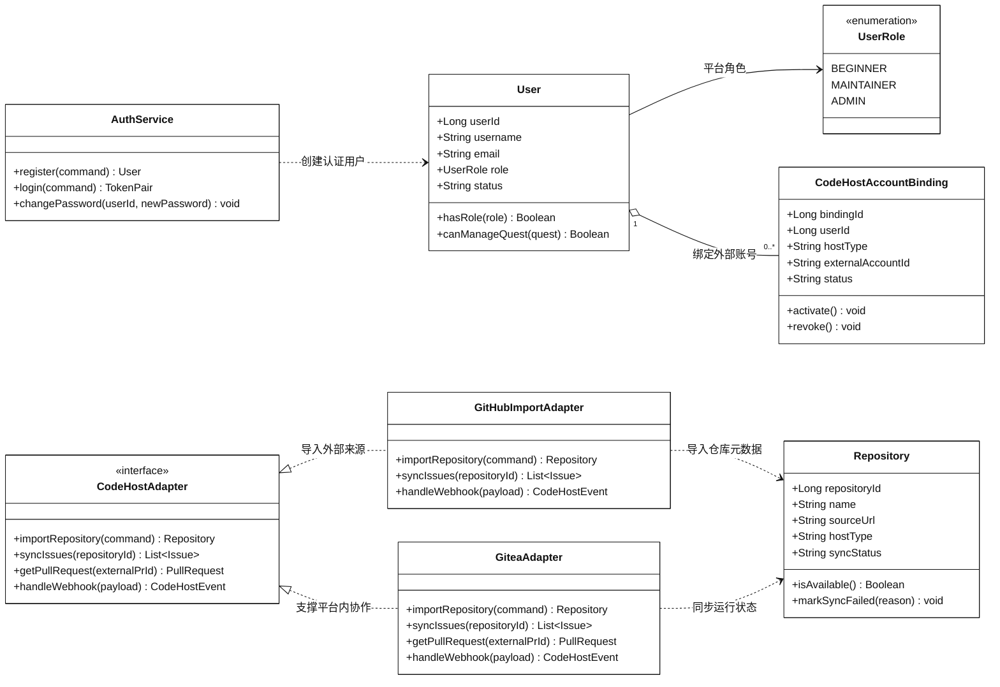
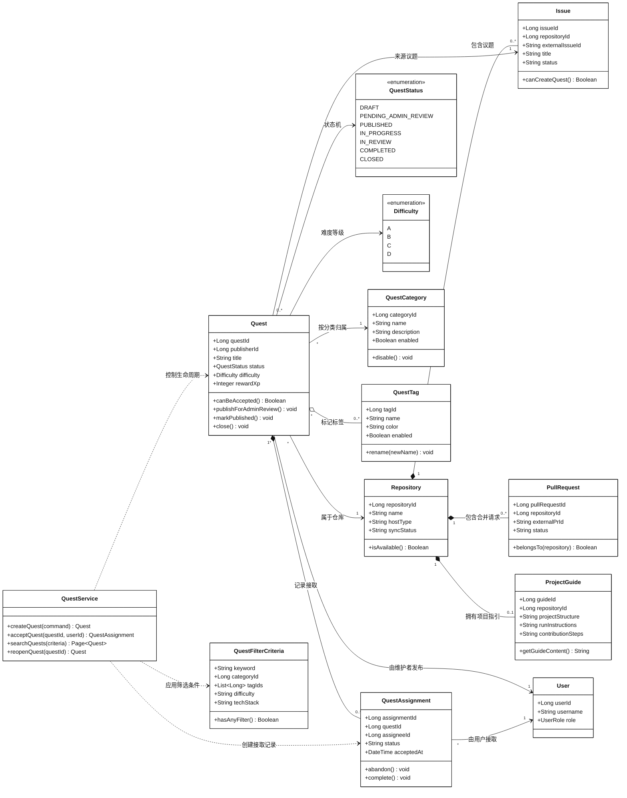
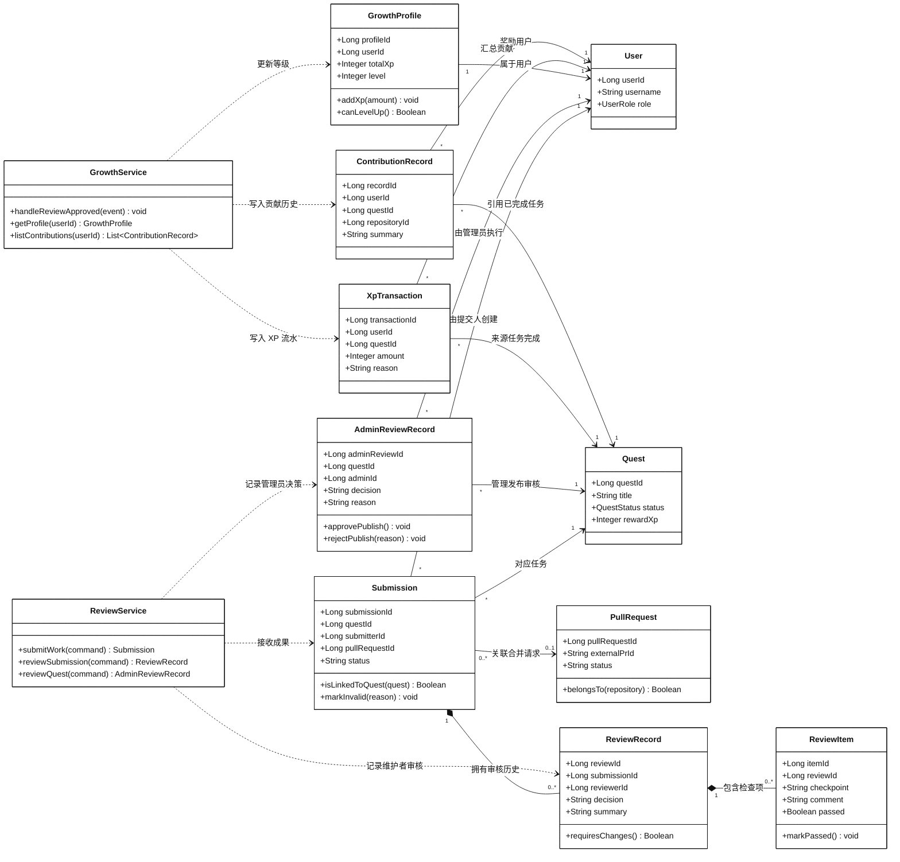
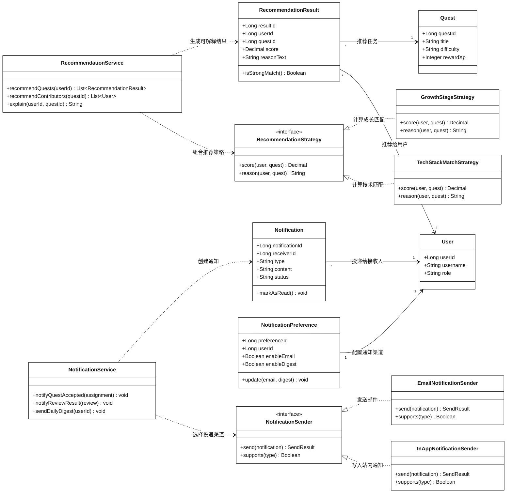

# Git Guild 核心类图

## 1. 说明

本文件按 P3 阶段 Mermaid 可视化规则重构类图。每张图都应能独立表达一个边界上下文的核心类、关键属性、关键方法和类之间关系。为保证 GitHub 预览清晰，整体类图仍拆分为四组。

类图按边界上下文拆分为四组：

| 分组           | 覆盖范围                                   |
| -------------- | ------------------------------------------ |
| 用户与外部支撑 | 用户、认证、外部代码托管适配               |
| 任务核心       | 仓库、议题、任务、分类、标签、接取         |
| 提交审核与成长 | 成果提交、维护者审核、管理员审核、成长记录 |
| 推荐与通知     | 推荐策略、推荐结果、通知偏好、通知投递     |

## 2. 用户与外部支撑

可视化说明

- 用户角色支撑认证流程和跨模块权限判断。
- 外部账号绑定独立于平台自有身份体系。
- 适配器隔离 GitHub 导入和 Gitea 协作差异。
- 仓库元数据不依赖具体外部平台客户端。

## 3. 任务核心

可视化说明

- 仓库上下文提供议题、合并请求和项目指引。
- 任务聚合分类、标签、状态、难度和接取历史。
- 筛选条件表达用户主动查找任务的意图。
- 服务方法负责约束任务生命周期状态流转。

## 4. 提交审核与成长

可视化说明

- 提交记录把完成成果和合并请求证据关联起来。
- 审核记录保存结论，审核项保存细粒度反馈。
- 管理员审核独立处理任务发布和下架治理。
- 审核通过后触发成长流水和贡献记录。

## 5. 推荐与通知

可视化说明

- 推荐策略支持扩展评分规则且不修改服务编排。
- 推荐结果持久化用户与任务的可解释匹配。
- 通知偏好独立配置投递渠道和汇总策略。
- 发送接口隔离具体投递方式和业务流程。

## 6. 设计模式应用说明

| 设计模式        | 应用位置                                                 | 使用理由                                                         | 如果不使用的后果                                                |
| --------------- | -------------------------------------------------------- | ---------------------------------------------------------------- | --------------------------------------------------------------- |
| 适配器模式      | `CodeHostAdapter`、`GitHubImportAdapter`、`GiteaAdapter` | 屏蔽 GitHub 与 Gitea API 差异，避免业务模块直接依赖外部平台      | 任务、审核、新手引导模块会散落外部 API 调用，后续替换底座成本高 |
| 策略模式        | `RecommendationStrategy` 及其实现类                      | 推荐系统是核心能力，后续需要按技术栈、成长阶段、历史行为扩展规则 | 新增推荐规则时会频繁修改 `RecommendationService`，违反开闭原则  |
| 策略 / 端口模式 | `NotificationSender` 及其实现类                          | 站内通知和邮件通知有不同投递方式，但上层通知流程应保持一致       | 通知服务会同时处理业务规则和具体通道，单一职责不清              |
