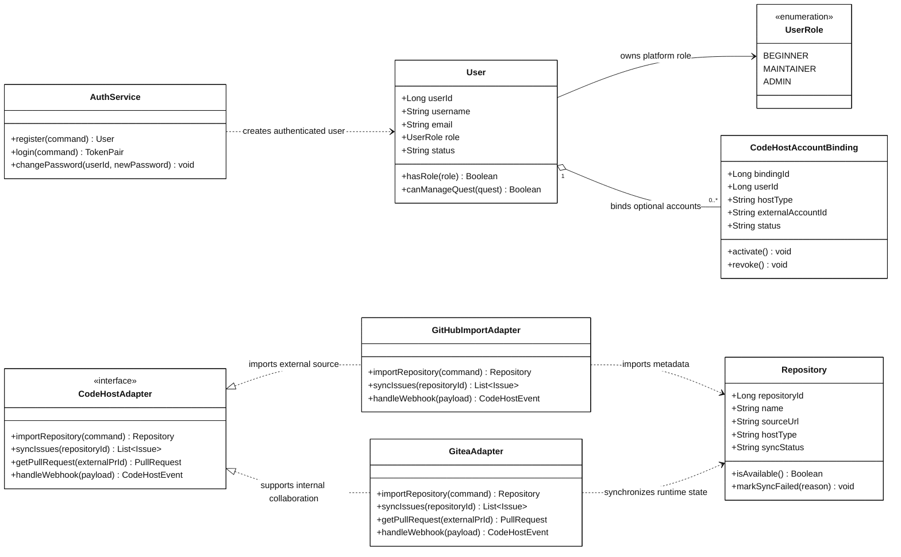
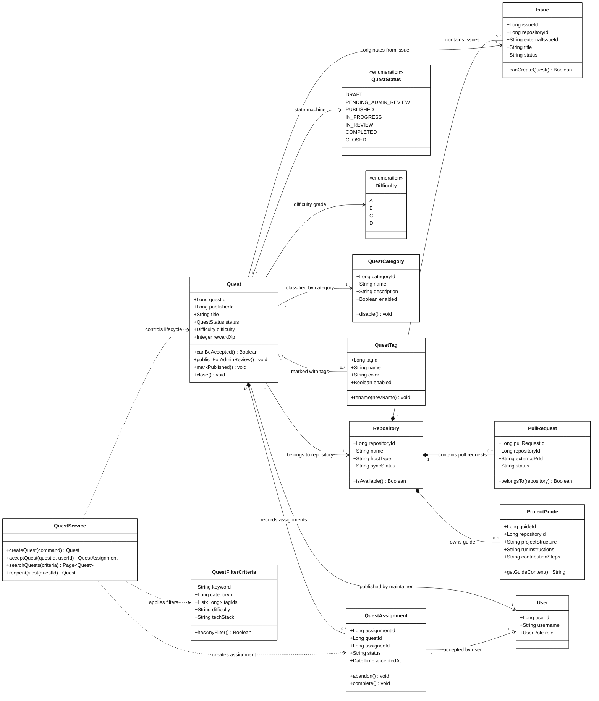
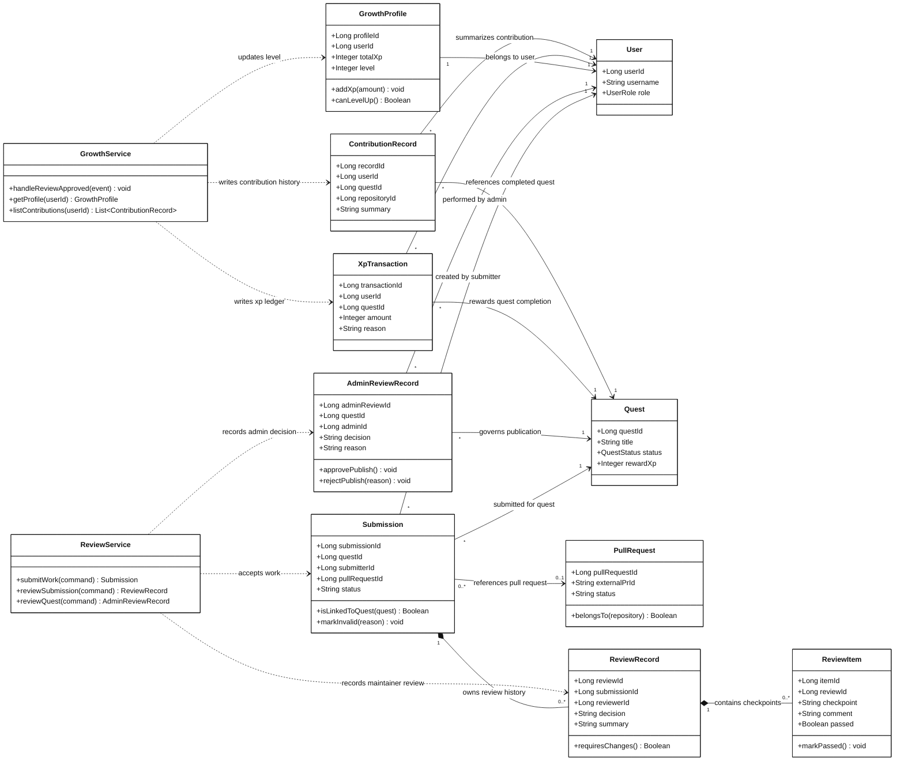
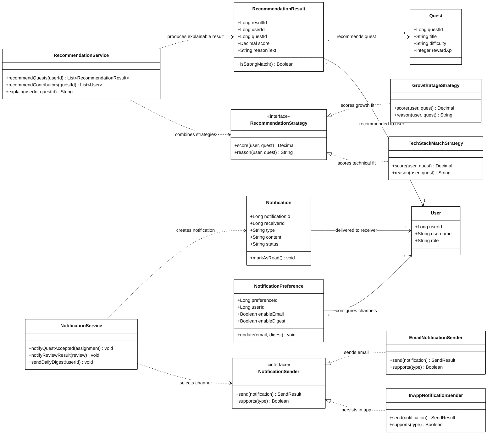

# Git Guild 核心类图

## 1. 说明

本文件按 P3 阶段 Mermaid 可视化规则重构类图。每张图都应能独立表达一个边界上下文的核心类、关键属性、关键方法和类之间关系。为保证 GitHub 预览清晰，整体类图仍拆分为四组。

类图按边界上下文拆分为四组：

| 分组           | 覆盖范围                                   |
| -------------- | ------------------------------------------ |
| 用户与外部支撑 | 用户、认证、外部代码托管适配               |
| 任务核心       | 仓库、Issue、任务、分类、标签、接取        |
| 提交审核与成长 | 成果提交、维护者审核、管理员审核、成长记录 |
| 推荐与通知     | 推荐策略、推荐结果、通知偏好、通知投递     |

## 2. 用户与外部支撑

VISUAL EXPLANATION

- User roles anchor authentication and downstream permission checks consistently across modules.
- Account bindings remain separate from platform-owned authentication and user identity.
- Adapters isolate GitHub import concerns from Gitea collaboration operations clearly.
- Repository metadata stays independent from concrete external platform client implementations.

## 3. 任务核心

VISUAL EXPLANATION

- Repository context supplies issues, pull requests, and project guidance.
- Quest aggregates classification, tags, state, difficulty, and assignment history.
- Filter criteria separates user search intent from recommendation decisions.
- Service methods enforce lifecycle transitions instead of frontend state changes.

## 4. 提交审核与成长

VISUAL EXPLANATION

- Submissions connect completed work with pull request evidence directly.
- Review records preserve decisions while review items capture granular feedback.
- Administrator reviews govern quest publication independently from submission review.
- Approved reviews trigger growth ledgers and visible contribution records.

## 5. 推荐与通知

VISUAL EXPLANATION

- Recommendation strategies expose extensible scoring without changing service orchestration.
- Results persist explainable matches between users and available quests.
- Notification preferences configure delivery without changing notification business events.
- Sender interfaces isolate delivery mechanisms from notification workflow decisions.

## 6. 设计模式应用说明

| 设计模式        | 应用位置                                                 | 使用理由                                                         | 如果不使用的后果                                                |
| --------------- | -------------------------------------------------------- | ---------------------------------------------------------------- | --------------------------------------------------------------- |
| 适配器模式      | `CodeHostAdapter`、`GitHubImportAdapter`、`GiteaAdapter` | 屏蔽 GitHub 与 Gitea API 差异，避免业务模块直接依赖外部平台      | 任务、审核、新手引导模块会散落外部 API 调用，后续替换底座成本高 |
| 策略模式        | `RecommendationStrategy` 及其实现类                      | 推荐系统是核心能力，后续需要按技术栈、成长阶段、历史行为扩展规则 | 新增推荐规则时会频繁修改 `RecommendationService`，违反开闭原则  |
| 策略 / 端口模式 | `NotificationSender` 及其实现类                          | 站内通知和邮件通知有不同投递方式，但上层通知流程应保持一致       | 通知服务会同时处理业务规则和具体通道，单一职责不清              |
