# Git Guild 核心类图

## 1. 核心类图

```mermaid
classDiagram
    direction TB

    class User {
        +Long userId
        +String username
        +String email
        +UserRole role
        +String passwordHash
        +UserStatus status
        +boolean hasRole(UserRole role)
        +boolean canManageQuest(Quest quest)
    }

    class AuthService {
        +User register(RegisterCommand command)
        +AuthToken login(LoginCommand command)
        +void changePassword(Long userId, String newPassword)
    }

    class CodeHostAccountBinding {
        +Long bindingId
        +Long userId
        +CodeHostType hostType
        +String externalAccountId
        +void activate()
        +void revoke()
    }

    class CodeHostAdapter {
        <<interface>>
        +RepositorySnapshot importRepository(RepositoryImportCommand command)
        +List~IssueSnapshot~ syncIssues(Long repositoryId)
        +PullRequestSnapshot getPullRequest(String externalPrId)
        +void handleWebhook(WebhookPayload payload)
    }

    class GitHubImportAdapter {
        +RepositorySnapshot importRepository(RepositoryImportCommand command)
        +List~IssueSnapshot~ syncIssues(Long repositoryId)
    }

    class GiteaAdapter {
        +RepositorySnapshot importRepository(RepositoryImportCommand command)
        +PullRequestSnapshot getPullRequest(String externalPrId)
        +void handleWebhook(WebhookPayload payload)
    }

    class Repository {
        +Long repositoryId
        +String name
        +String sourceUrl
        +CodeHostType hostType
        +SyncStatus syncStatus
        +boolean isAvailable()
        +void markSyncFailed(String reason)
    }

    class Issue {
        +Long issueId
        +Long repositoryId
        +String externalIssueId
        +String title
        +IssueStatus status
        +boolean canCreateQuest()
    }

    class PullRequest {
        +Long pullRequestId
        +Long repositoryId
        +String externalPrId
        +String title
        +PullRequestStatus status
        +boolean belongsTo(Repository repository)
    }

    class Quest {
        +Long questId
        +String title
        +String description
        +QuestStatus status
        +Integer rewardXp
        +Integer estimatedHours
        +String completionCriteria
        +boolean canBeAccepted()
        +void publishForAdminReview()
        +void markPublished()
        +void close()
    }

    class QuestCategory {
        +Long categoryId
        +String name
        +String description
        +boolean enabled
        +void disable()
    }

    class QuestTag {
        +Long tagId
        +String name
        +String color
        +boolean enabled
        +void rename(String newName)
    }

    class QuestFilterCriteria {
        +String techStack
        +Difficulty difficulty
        +Long categoryId
        +List~Long~ tagIds
        +QuestStatus status
        +SortOption sortBy
        +boolean hasAnyFilter()
    }

    class QuestAssignment {
        +Long assignmentId
        +Long questId
        +Long assigneeId
        +AssignmentStatus status
        +LocalDateTime acceptedAt
        +void abandon()
        +void complete()
    }

    class QuestService {
        +Quest createQuest(CreateQuestCommand command)
        +Quest acceptQuest(Long questId, Long userId)
        +List~Quest~ searchQuests(QuestFilterCriteria criteria)
        +void reopenQuest(Long questId)
    }

    class Submission {
        +Long submissionId
        +Long questId
        +Long submitterId
        +Long pullRequestId
        +String description
        +SubmissionStatus status
        +boolean isLinkedToQuest(Quest quest)
        +void markInvalid(String reason)
    }

    class ReviewRecord {
        +Long reviewId
        +Long submissionId
        +Long reviewerId
        +ReviewDecision decision
        +String summary
        +LocalDateTime reviewedAt
        +boolean requiresChanges()
    }

    class ReviewItem {
        +Long itemId
        +Long reviewId
        +String checkpoint
        +String comment
        +boolean passed
        +void markPassed()
    }

    class AdminReviewRecord {
        +Long adminReviewId
        +Long questId
        +Long adminId
        +AdminReviewDecision decision
        +String reason
        +void approvePublish()
        +void rejectPublish(String reason)
    }

    class ReviewService {
        +Submission submitWork(SubmitWorkCommand command)
        +ReviewRecord reviewSubmission(ReviewCommand command)
        +AdminReviewRecord reviewQuest(AdminReviewCommand command)
    }

    class ProjectGuide {
        +Long guideId
        +Long repositoryId
        +String projectStructure
        +String runInstructions
        +String contributionSteps
        +String getGuideContent()
    }

    class RecommendationStrategy {
        <<interface>>
        +RecommendationScore score(User user, Quest quest)
        +String reason(User user, Quest quest)
    }

    class TechStackMatchStrategy {
        +RecommendationScore score(User user, Quest quest)
        +String reason(User user, Quest quest)
    }

    class GrowthStageStrategy {
        +RecommendationScore score(User user, Quest quest)
        +String reason(User user, Quest quest)
    }

    class RecommendationService {
        +List~RecommendationResult~ recommendQuests(Long userId)
        +List~RecommendationResult~ recommendContributors(Long questId)
        +RecommendationResult explain(Long userId, Long questId)
    }

    class RecommendationResult {
        +Long resultId
        +Long userId
        +Long questId
        +Integer score
        +String reasonText
        +boolean isStrongMatch()
    }

    class GrowthProfile {
        +Long profileId
        +Long userId
        +Integer totalXp
        +Integer level
        +Integer completedQuestCount
        +void addXp(Integer amount)
        +boolean canLevelUp()
    }

    class XpTransaction {
        +Long transactionId
        +Long userId
        +Long questId
        +Integer amount
        +String reason
        +LocalDateTime createdAt
    }

    class ContributionRecord {
        +Long recordId
        +Long userId
        +Long questId
        +Long repositoryId
        +String summary
        +LocalDateTime completedAt
    }

    class GrowthService {
        +void handleReviewApproved(ReviewApprovedEvent event)
        +GrowthProfile getProfile(Long userId)
        +List~ContributionRecord~ listContributions(Long userId)
    }

    class Notification {
        +Long notificationId
        +Long receiverId
        +NotificationType type
        +String content
        +NotificationStatus status
        +void markAsRead()
    }

    class NotificationPreference {
        +Long preferenceId
        +Long userId
        +boolean enableEmail
        +boolean enableDigest
        +void update(boolean email, boolean digest)
    }

    class NotificationSender {
        <<interface>>
        +void send(Notification notification)
        +boolean supports(NotificationType type)
    }

    class InAppNotificationSender {
        +void send(Notification notification)
        +boolean supports(NotificationType type)
    }

    class EmailNotificationSender {
        +void send(Notification notification)
        +boolean supports(NotificationType type)
    }

    class NotificationService {
        +void notifyQuestAccepted(QuestAssignment assignment)
        +void notifyReviewResult(ReviewRecord review)
        +void sendDailyDigest(Long userId)
    }

    class UserRole {
        <<enumeration>>
        BEGINNER
        MAINTAINER
        ADMIN
    }

    class QuestStatus {
        <<enumeration>>
        DRAFT
        PENDING_ADMIN_REVIEW
        PUBLISHED
        IN_PROGRESS
        IN_REVIEW
        RETURNED
        COMPLETED
        CLOSED
        SYNC_ERROR
    }

    class Difficulty {
        <<enumeration>>
        A
        B
        C
        D
    }

    User --> UserRole
    User "1" o-- "0..*" CodeHostAccountBinding
    AuthService ..> User

    CodeHostAdapter <|.. GitHubImportAdapter
    CodeHostAdapter <|.. GiteaAdapter
    Repository "1" *-- "0..*" Issue
    Repository "1" *-- "0..*" PullRequest
    Repository "1" *-- "0..1" ProjectGuide

    Quest --> QuestStatus
    Quest "*" --> "1" Repository
    Quest "0..*" --> "1" Issue
    Quest "*" --> "1" QuestCategory
    Quest "*" o-- "0..*" QuestTag
    Quest "1" *-- "0..*" QuestAssignment
    QuestService ..> Quest
    QuestService ..> QuestFilterCriteria

    Submission "*" --> "1" Quest
    Submission "*" --> "1" User
    Submission "0..*" --> "0..1" PullRequest
    Submission "1" *-- "0..*" ReviewRecord
    ReviewRecord "1" *-- "0..*" ReviewItem
    AdminReviewRecord "*" --> "1" Quest
    ReviewService ..> Submission
    ReviewService ..> ReviewRecord
    ReviewService ..> AdminReviewRecord

    RecommendationStrategy <|.. TechStackMatchStrategy
    RecommendationStrategy <|.. GrowthStageStrategy
    RecommendationService ..> RecommendationStrategy
    RecommendationService ..> RecommendationResult
    RecommendationResult "*" --> "1" Quest
    RecommendationResult "*" --> "1" User

    GrowthProfile "1" --> "1" User
    XpTransaction "*" --> "1" User
    ContributionRecord "*" --> "1" User
    ContributionRecord "*" --> "1" Quest
    GrowthService ..> GrowthProfile
    GrowthService ..> XpTransaction
    GrowthService ..> ContributionRecord

    Notification "*" --> "1" User
    NotificationPreference "1" --> "1" User
    NotificationSender <|.. InAppNotificationSender
    NotificationSender <|.. EmailNotificationSender
    NotificationService ..> NotificationSender
    NotificationService ..> Notification
```

## 2. 类成员标注说明

### 2.1 用户与认证模块

| 类                       | 属性 / 方法                           | 标注说明                                   |
| ------------------------ | ------------------------------------- | ------------------------------------------ |
| `User`                   | `userId`                              | 平台用户主键，供任务、提交、通知等模块引用 |
| `User`                   | `username`                            | 平台内展示名称                             |
| `User`                   | `email`                               | 登录和邮件通知使用的邮箱                   |
| `User`                   | `role`                                | 用户角色，区分初学者、维护者和管理员       |
| `User`                   | `passwordHash`                        | 加密后的密码摘要，不保存明文密码           |
| `User`                   | `status`                              | 用户状态，用于冻结、禁用等权限控制         |
| `User`                   | `hasRole(role)`                       | 判断用户是否具有指定角色                   |
| `User`                   | `canManageQuest(quest)`               | 判断用户是否可管理某个任务                 |
| `AuthService`            | `register(command)`                   | 处理注册流程，生成平台用户                 |
| `AuthService`            | `login(command)`                      | 校验登录信息并签发认证令牌                 |
| `AuthService`            | `changePassword(userId, newPassword)` | 修改密码并重新生成密码摘要                 |
| `CodeHostAccountBinding` | `bindingId`                           | 外部代码托管账号绑定记录主键               |
| `CodeHostAccountBinding` | `userId`                              | 绑定到平台用户                             |
| `CodeHostAccountBinding` | `hostType`                            | 外部平台类型，如 GitHub 或 Gitea           |
| `CodeHostAccountBinding` | `externalAccountId`                   | 外部平台中的账号标识                       |
| `CodeHostAccountBinding` | `activate()`                          | 启用该账号绑定                             |
| `CodeHostAccountBinding` | `revoke()`                            | 撤销该账号绑定                             |

### 2.2 代码托管底座适配模块

| 类                    | 属性 / 方法                    | 标注说明                          |
| --------------------- | ------------------------------ | --------------------------------- |
| `CodeHostAdapter`     | `importRepository(command)`    | 导入或接入外部仓库                |
| `CodeHostAdapter`     | `syncIssues(repositoryId)`     | 同步仓库 Issue 元数据             |
| `CodeHostAdapter`     | `getPullRequest(externalPrId)` | 获取外部 PR 状态                  |
| `CodeHostAdapter`     | `handleWebhook(payload)`       | 处理外部平台推送事件              |
| `GitHubImportAdapter` | `importRepository(command)`    | 从 GitHub 导入仓库信息            |
| `GitHubImportAdapter` | `syncIssues(repositoryId)`     | 从 GitHub 同步 Issue              |
| `GiteaAdapter`        | `importRepository(command)`    | 将仓库接入 Gitea 运行底座         |
| `GiteaAdapter`        | `getPullRequest(externalPrId)` | 查询 Gitea PR 状态                |
| `GiteaAdapter`        | `handleWebhook(payload)`       | 处理 Gitea Webhook                |
| `Repository`          | `repositoryId`                 | 仓库主键                          |
| `Repository`          | `name`                         | 仓库名称                          |
| `Repository`          | `sourceUrl`                    | 外部来源地址或导入地址            |
| `Repository`          | `hostType`                     | 仓库当前所属托管平台              |
| `Repository`          | `syncStatus`                   | 仓库导入或同步状态                |
| `Repository`          | `isAvailable()`                | 判断仓库是否可用于任务发布        |
| `Repository`          | `markSyncFailed(reason)`       | 标记同步失败并记录原因            |
| `Issue`               | `issueId`                      | 平台内 Issue 主键                 |
| `Issue`               | `repositoryId`                 | 所属仓库主键                      |
| `Issue`               | `externalIssueId`              | 外部平台 Issue 标识               |
| `Issue`               | `title`                        | Issue 标题                        |
| `Issue`               | `status`                       | Issue 开放、关闭或同步异常状态    |
| `Issue`               | `canCreateQuest()`             | 判断该 Issue 是否可转化为任务     |
| `PullRequest`         | `pullRequestId`                | 平台内 PR 主键                    |
| `PullRequest`         | `repositoryId`                 | 所属仓库主键                      |
| `PullRequest`         | `externalPrId`                 | 外部平台 PR 标识                  |
| `PullRequest`         | `title`                        | PR 标题                           |
| `PullRequest`         | `status`                       | PR 打开、合并、关闭或同步异常状态 |
| `PullRequest`         | `belongsTo(repository)`        | 校验 PR 是否属于任务关联仓库      |

### 2.3 任务与悬赏模块

| 类                    | 属性 / 方法                    | 标注说明                           |
| --------------------- | ------------------------------ | ---------------------------------- |
| `Quest`               | `questId`                      | 任务主键                           |
| `Quest`               | `title`                        | 任务标题                           |
| `Quest`               | `description`                  | 任务描述                           |
| `Quest`               | `status`                       | 任务状态，驱动接取、审核和关闭流程 |
| `Quest`               | `rewardXp`                     | 完成任务后可获得的 XP              |
| `Quest`               | `estimatedHours`               | 预计工作量，用于筛选和推荐         |
| `Quest`               | `completionCriteria`           | 完成标准，用于审核判断             |
| `Quest`               | `canBeAccepted()`              | 判断任务是否可被接取               |
| `Quest`               | `publishForAdminReview()`      | 提交管理员审核                     |
| `Quest`               | `markPublished()`              | 管理员通过后发布任务               |
| `Quest`               | `close()`                      | 关闭或下架任务                     |
| `QuestCategory`       | `categoryId`                   | 任务分类主键                       |
| `QuestCategory`       | `name`                         | 分类名称                           |
| `QuestCategory`       | `description`                  | 分类说明                           |
| `QuestCategory`       | `enabled`                      | 分类是否可用                       |
| `QuestCategory`       | `disable()`                    | 禁用分类                           |
| `QuestTag`            | `tagId`                        | 标签主键                           |
| `QuestTag`            | `name`                         | 标签名称                           |
| `QuestTag`            | `color`                        | 标签展示颜色                       |
| `QuestTag`            | `enabled`                      | 标签是否可用                       |
| `QuestTag`            | `rename(newName)`              | 修改标签名称                       |
| `QuestFilterCriteria` | `techStack`                    | 技术栈筛选条件                     |
| `QuestFilterCriteria` | `difficulty`                   | 难度筛选条件                       |
| `QuestFilterCriteria` | `categoryId`                   | 分类筛选条件                       |
| `QuestFilterCriteria` | `tagIds`                       | 标签筛选条件                       |
| `QuestFilterCriteria` | `status`                       | 状态筛选条件                       |
| `QuestFilterCriteria` | `sortBy`                       | 列表排序规则                       |
| `QuestFilterCriteria` | `hasAnyFilter()`               | 判断是否设置筛选条件               |
| `QuestAssignment`     | `assignmentId`                 | 接取记录主键                       |
| `QuestAssignment`     | `questId`                      | 被接取的任务                       |
| `QuestAssignment`     | `assigneeId`                   | 接取人                             |
| `QuestAssignment`     | `status`                       | 接取状态，如进行中、已放弃、已完成 |
| `QuestAssignment`     | `acceptedAt`                   | 接取时间                           |
| `QuestAssignment`     | `abandon()`                    | 放弃任务并保留历史记录             |
| `QuestAssignment`     | `complete()`                   | 标记接取记录完成                   |
| `QuestService`        | `createQuest(command)`         | 基于 Issue 创建结构化任务          |
| `QuestService`        | `acceptQuest(questId, userId)` | 接取任务并处理并发冲突             |
| `QuestService`        | `searchQuests(criteria)`       | 按筛选条件查询任务                 |
| `QuestService`        | `reopenQuest(questId)`         | 将可重开的任务重新开放             |

### 2.4 提交与审核反馈模块

| 类                  | 属性 / 方法                 | 标注说明                         |
| ------------------- | --------------------------- | -------------------------------- |
| `Submission`        | `submissionId`              | 提交记录主键                     |
| `Submission`        | `questId`                   | 所属任务                         |
| `Submission`        | `submitterId`               | 提交人                           |
| `Submission`        | `pullRequestId`             | 关联 PR                          |
| `Submission`        | `description`               | 成果说明                         |
| `Submission`        | `status`                    | 提交状态，如待审核、无效、已审核 |
| `Submission`        | `isLinkedToQuest(quest)`    | 校验提交是否关联正确任务         |
| `Submission`        | `markInvalid(reason)`       | 标记提交无效并记录原因           |
| `ReviewRecord`      | `reviewId`                  | 审核记录主键                     |
| `ReviewRecord`      | `submissionId`              | 被审核提交                       |
| `ReviewRecord`      | `reviewerId`                | 审核人                           |
| `ReviewRecord`      | `decision`                  | 审核结论                         |
| `ReviewRecord`      | `summary`                   | 审核总结                         |
| `ReviewRecord`      | `reviewedAt`                | 审核时间                         |
| `ReviewRecord`      | `requiresChanges()`         | 判断是否需要修改                 |
| `ReviewItem`        | `itemId`                    | 逐项审核意见主键                 |
| `ReviewItem`        | `reviewId`                  | 所属审核记录                     |
| `ReviewItem`        | `checkpoint`                | 审核检查项                       |
| `ReviewItem`        | `comment`                   | 具体修改意见                     |
| `ReviewItem`        | `passed`                    | 该检查项是否通过                 |
| `ReviewItem`        | `markPassed()`              | 标记检查项通过                   |
| `AdminReviewRecord` | `adminReviewId`             | 管理员审核记录主键               |
| `AdminReviewRecord` | `questId`                   | 被审核任务                       |
| `AdminReviewRecord` | `adminId`                   | 管理员用户                       |
| `AdminReviewRecord` | `decision`                  | 管理员审核结论                   |
| `AdminReviewRecord` | `reason`                    | 通过、退回或下架原因             |
| `AdminReviewRecord` | `approvePublish()`          | 审核通过并允许发布               |
| `AdminReviewRecord` | `rejectPublish(reason)`     | 退回任务并说明原因               |
| `ReviewService`     | `submitWork(command)`       | 提交成果并进入审核流程           |
| `ReviewService`     | `reviewSubmission(command)` | 维护者审核提交成果               |
| `ReviewService`     | `reviewQuest(command)`      | 管理员审核任务内容               |

### 2.5 新手引导与推荐匹配模块

| 类                       | 属性 / 方法                      | 标注说明                     |
| ------------------------ | -------------------------------- | ---------------------------- |
| `ProjectGuide`           | `guideId`                        | 指引记录主键                 |
| `ProjectGuide`           | `repositoryId`                   | 关联仓库                     |
| `ProjectGuide`           | `projectStructure`               | 项目结构说明                 |
| `ProjectGuide`           | `runInstructions`                | 运行说明                     |
| `ProjectGuide`           | `contributionSteps`              | 贡献流程说明                 |
| `ProjectGuide`           | `getGuideContent()`              | 获取完整新手指引内容         |
| `RecommendationStrategy` | `score(user, quest)`             | 计算某策略下的推荐分数       |
| `RecommendationStrategy` | `reason(user, quest)`            | 生成某策略下的推荐理由       |
| `TechStackMatchStrategy` | `score(user, quest)`             | 按技术栈匹配计算分数         |
| `TechStackMatchStrategy` | `reason(user, quest)`            | 说明技术栈匹配原因           |
| `GrowthStageStrategy`    | `score(user, quest)`             | 按成长阶段和任务难度计算分数 |
| `GrowthStageStrategy`    | `reason(user, quest)`            | 说明成长阶段匹配原因         |
| `RecommendationService`  | `recommendQuests(userId)`        | 为初学者推荐任务             |
| `RecommendationService`  | `recommendContributors(questId)` | 为维护者推荐贡献者           |
| `RecommendationService`  | `explain(userId, questId)`       | 查询推荐理由                 |
| `RecommendationResult`   | `resultId`                       | 推荐结果主键                 |
| `RecommendationResult`   | `userId`                         | 被推荐用户                   |
| `RecommendationResult`   | `questId`                        | 被推荐任务                   |
| `RecommendationResult`   | `score`                          | 综合推荐分数                 |
| `RecommendationResult`   | `reasonText`                     | 可展示的推荐理由             |
| `RecommendationResult`   | `isStrongMatch()`                | 判断是否为强匹配结果         |

### 2.6 成长激励模块

| 类                   | 属性 / 方法                   | 标注说明                     |
| -------------------- | ----------------------------- | ---------------------------- |
| `GrowthProfile`      | `profileId`                   | 成长档案主键                 |
| `GrowthProfile`      | `userId`                      | 关联用户                     |
| `GrowthProfile`      | `totalXp`                     | 累计 XP                      |
| `GrowthProfile`      | `level`                       | 当前等级                     |
| `GrowthProfile`      | `completedQuestCount`         | 已完成任务数量               |
| `GrowthProfile`      | `addXp(amount)`               | 增加 XP                      |
| `GrowthProfile`      | `canLevelUp()`                | 判断是否满足升级条件         |
| `XpTransaction`      | `transactionId`               | XP 流水主键                  |
| `XpTransaction`      | `userId`                      | 获得 XP 的用户               |
| `XpTransaction`      | `questId`                     | XP 来源任务                  |
| `XpTransaction`      | `amount`                      | XP 数量                      |
| `XpTransaction`      | `reason`                      | XP 变更原因                  |
| `XpTransaction`      | `createdAt`                   | XP 流水创建时间              |
| `ContributionRecord` | `recordId`                    | 贡献记录主键                 |
| `ContributionRecord` | `userId`                      | 贡献者                       |
| `ContributionRecord` | `questId`                     | 对应任务                     |
| `ContributionRecord` | `repositoryId`                | 对应仓库                     |
| `ContributionRecord` | `summary`                     | 可展示的项目经历摘要         |
| `ContributionRecord` | `completedAt`                 | 完成时间                     |
| `GrowthService`      | `handleReviewApproved(event)` | 审核通过后更新 XP 和贡献记录 |
| `GrowthService`      | `getProfile(userId)`          | 查询成长档案                 |
| `GrowthService`      | `listContributions(userId)`   | 查询贡献记录                 |

### 2.7 通知模块

| 类                        | 属性 / 方法                       | 标注说明                         |
| ------------------------- | --------------------------------- | -------------------------------- |
| `Notification`            | `notificationId`                  | 通知主键                         |
| `Notification`            | `receiverId`                      | 接收人                           |
| `Notification`            | `type`                            | 通知类型                         |
| `Notification`            | `content`                         | 通知内容                         |
| `Notification`            | `status`                          | 通知状态，如未读、已读、发送失败 |
| `Notification`            | `markAsRead()`                    | 标记站内通知已读                 |
| `NotificationPreference`  | `preferenceId`                    | 通知偏好主键                     |
| `NotificationPreference`  | `userId`                          | 关联用户                         |
| `NotificationPreference`  | `enableEmail`                     | 是否启用邮件通知                 |
| `NotificationPreference`  | `enableDigest`                    | 是否启用每日汇总                 |
| `NotificationPreference`  | `update(email, digest)`           | 修改通知偏好                     |
| `NotificationSender`      | `send(notification)`              | 发送通知                         |
| `NotificationSender`      | `supports(type)`                  | 判断发送器是否支持某类通知       |
| `InAppNotificationSender` | `send(notification)`              | 写入站内通知                     |
| `InAppNotificationSender` | `supports(type)`                  | 判断是否支持站内通知             |
| `EmailNotificationSender` | `send(notification)`              | 发送邮件通知                     |
| `EmailNotificationSender` | `supports(type)`                  | 判断是否支持邮件通知             |
| `NotificationService`     | `notifyQuestAccepted(assignment)` | 发送任务接取通知                 |
| `NotificationService`     | `notifyReviewResult(review)`      | 发送审核结果通知                 |
| `NotificationService`     | `sendDailyDigest(userId)`         | 发送每日汇总通知                 |

## 3. 设计模式应用说明

| 设计模式        | 应用位置                                                                   | 使用理由                                                           | 如果不使用的后果                                                |
| --------------- | -------------------------------------------------------------------------- | ------------------------------------------------------------------ | --------------------------------------------------------------- |
| 适配器模式      | `CodeHostAdapter`、`GitHubImportAdapter`、`GiteaAdapter`                   | 统一屏蔽 GitHub 与 Gitea 的 API 差异，避免业务模块直接依赖外部平台 | 任务、审核、新手引导模块会散落外部 API 调用，后续替换底座成本高 |
| 策略模式        | `RecommendationStrategy`、`TechStackMatchStrategy`、`GrowthStageStrategy`  | 推荐系统是核心能力，后续需要按技术栈、成长阶段、历史行为扩展规则   | 新增推荐规则时会频繁修改 `RecommendationService`，违反开闭原则  |
| 策略 / 端口模式 | `NotificationSender`、`InAppNotificationSender`、`EmailNotificationSender` | 站内通知和邮件通知有不同投递方式，但上层通知流程应保持一致         | 通知服务会同时处理业务规则和具体通道，单一职责不清              |
