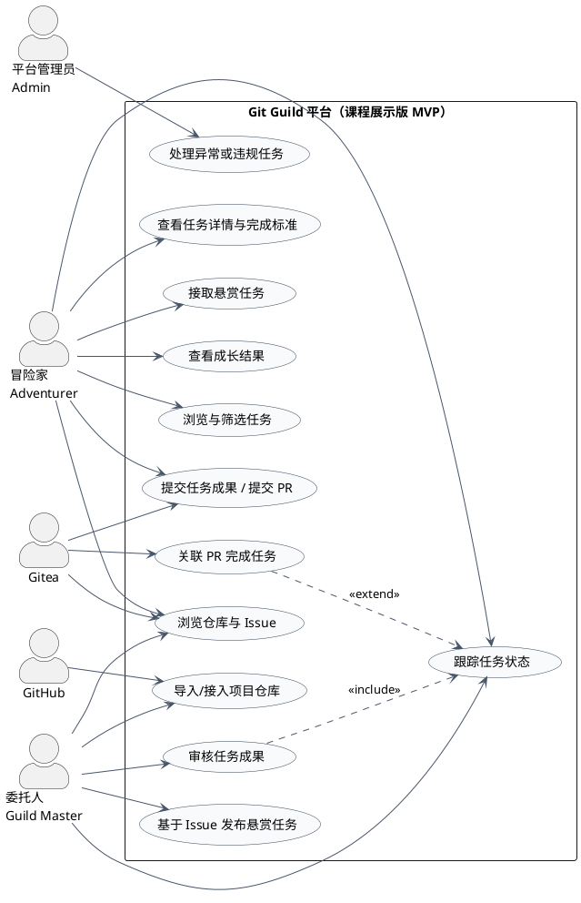

# Git Guild 系统级用例图

## 参与者列表

1. `冒险家 Adventurer`
2. `委托人 Guild Master`
3. `平台管理员 Admin`
4. `GitHub`
5. `Gitea`

---

## 核心用例列表

1. `导入/接入项目仓库`
2. `浏览仓库与 Issue`
3. `基于 Issue 发布悬赏任务`
4. `浏览与筛选任务`
5. `查看任务详情与完成标准`
6. `接取悬赏任务`
7. `提交任务成果 / 提交 PR`
8. `审核任务成果`
9. `跟踪任务状态`
10. `关联 PR 完成任务`
11. `查看成长结果`
12. `处理异常或违规任务`

---

## PlantUML 源码

## PlantUML 图示
![[用例图图示.svg]]

---
# Git Guild 详细用例描述（3 个核心用例）

---

## UC-01 导入/接入项目仓库

### 1. ID

`UC-01`

### 2. 名称

`导入/接入项目仓库`

### 3. 参与者

- 主要参与者：`委托人 Guild Master`
- 次要参与者：`GitHub`、`Gitea`

### 4. 触发条件

委托人希望将 GitHub 上的项目仓库导入或接入 Git Guild 平台，用于后续的仓库浏览、Issue 关联和任务发布。

### 5. 前置条件

- 委托人已具备平台中的项目管理权限。
- 目标仓库在 GitHub 上可访问，或委托人具备相应访问权限。
- 平台已正确连接代码托管底座 Gitea。

### 6. 后置条件

- 成功后：
  - 平台中创建或关联目标项目仓库。
  - 仓库基本信息可在平台内浏览。
  - 仓库的 Issue 列表可用于后续任务发布。
- 失败后：
  - 平台不发布不完整的项目接入结果。
  - 系统保留失败原因，供委托人重试或处理。

### 7. 正常流程

1. 委托人在平台中选择“导入/接入项目仓库”。
2. 系统要求委托人填写目标仓库来源信息，例如 GitHub 仓库地址。
3. 委托人提交仓库信息并确认导入。
4. 系统检查目标仓库是否可访问，并读取仓库基本信息。
5. 系统调用 Gitea 完成仓库导入或接入。
6. 系统同步仓库的基本元数据与可见 Issue 信息。
7. 系统在 Git Guild 中创建项目记录并建立与仓库的关联。
8. 系统向委托人显示导入成功结果，委托人可继续浏览仓库与 Issue。

### 8. 扩展流程

- `4a` 目标仓库地址无效或仓库不可访问
  - 系统提示仓库地址错误或访问失败。
  - 委托人可修改后重新提交。

- `4b` 委托人无权限访问目标仓库
  - 系统提示权限不足。
  - 本次导入终止，不创建项目记录。

- `5a` Gitea 导入失败
  - 系统提示导入失败并记录失败原因。
  - 委托人可稍后重新发起导入。

- `6a` 仓库导入成功但 Issue 同步失败
  - 系统提示“仓库已导入，但 Issue 未完全同步”。
  - 平台将项目标记为“待补同步”状态，避免直接用于任务发布。

- `7a` 目标仓库已在平台中接入
  - 系统提示该仓库已存在。
  - 委托人可直接进入已有项目页面。

---

## UC-03 基于 Issue 发布悬赏任务

### 1. ID

`UC-03`

### 2. 名称

`基于 Issue 发布悬赏任务`

### 3. 参与者

- 主要参与者：`委托人 Guild Master`
- 次要参与者：`Gitea`

### 4. 触发条件

委托人希望将仓库中的一个真实 Issue 转换成适合贡献者接取的结构化悬赏任务。

### 5. 前置条件

- 目标项目仓库已成功接入 Git Guild。
- 目标 Issue 已存在，并可在平台内查看。
- 委托人具备该项目的任务发布权限。

### 6. 后置条件

- 成功后：
  - 平台中创建一条新的悬赏任务。
  - 任务与指定 Issue 建立关联。
  - 任务进入“待接取”状态，并出现在任务大厅中。
- 失败后：
  - 平台不发布信息不完整或关联异常的任务。
  - 委托人可以继续补充信息后重新发布。

### 7. 正常流程

1. 委托人在平台中进入某个已接入项目的仓库与 Issue 列表。
2. 委托人选择一个适合任务化的 Issue。
3. 系统提供“基于 Issue 发布悬赏任务”的创建入口，并预填标题与基础描述。
4. 委托人补充任务信息，包括难度、技术栈、预计工作量、是否适合新手、完成标准等。
5. 系统检查任务信息是否完整，尤其是完成标准与 Issue 关联是否明确。
6. 委托人确认发布任务。
7. 系统创建任务记录，并与对应 Issue 建立关联。
8. 系统将任务置为“待接取”状态，并展示在任务大厅中。

### 8. 扩展流程

- `2a` 选中的 Issue 已关闭或不适合任务化
  - 系统提示该 Issue 当前不可发布为悬赏任务。
  - 委托人返回 Issue 列表重新选择。

- `4a` 委托人未填写关键字段
  - 系统提示必须补充的字段，例如完成标准、预计工作量。
  - 委托人补充后继续发布。

- `5a` 任务描述与完成标准不清晰
  - 系统提示委托人补充更明确的完成标准。
  - 本次发布暂不完成。

- `7a` 该 Issue 已关联一个仍在进行中的任务
  - 系统提示重复关联风险。
  - 委托人不得再次发布重复任务。

- `7b` 平台保存任务失败
  - 系统提示发布失败。
  - 本次任务不进入任务大厅。

---

## UC-08 审核任务成果

### 1. ID

`UC-08`

### 2. 名称

`审核任务成果`

### 3. 参与者

- 主要参与者：`委托人 Guild Master`
- 次要参与者：`冒险家 Adventurer`、`Gitea`

### 4. 触发条件

冒险家已提交任务成果或 Pull Request，委托人需要根据完成标准进行审核并给出处理结果。

### 5. 前置条件

- 任务已被某位冒险家接取。
- 冒险家已提交成果，且任务进入待审核阶段。
- 委托人具备查看该任务及其关联成果的审核权限。

### 6. 后置条件

- 成功后：
  - 平台记录审核结果与审核意见。
  - 任务状态被更新为“已完成”或“已退回/待修改”。
  - 若成果通过并满足完成条件，平台记录成长结果。
- 失败后：
  - 任务保持原状态或进入异常待处理状态。
  - 冒险家可查看失败或异常原因。

### 7. 正常流程

1. 委托人在平台中打开待审核任务。
2. 系统展示任务信息、完成标准、提交成果以及关联 PR 的关键信息。
3. 委托人根据任务完成标准检查提交内容。
4. 委托人填写审核意见。
5. 委托人选择审核结果，例如“通过”或“要求修改”。
6. 系统记录审核结果与审核意见。
7. 系统更新任务状态，并将结果反馈给冒险家。
8. 若任务通过且关联 PR 已满足完成条件，系统记录任务完成并生成成长结果。
9. 冒险家可查看最终任务状态、审核反馈与成长结果。

### 8. 扩展流程

- `2a` 提交成果缺失或无法查看
  - 系统提示成果不完整或读取失败。
  - 委托人可暂不完成审核，并要求冒险家重新提交。

- `3a` 提交内容未满足完成标准
  - 委托人记录具体修改建议。
  - 系统将任务状态更新为“已退回/待修改”。

- `5a` 委托人认为当前任务不应继续推进（如关联 Issue 已被解决、任务定义错误、需求已变更）
  - 系统允许委托人终止当前审核，并将任务转入异常待处理流程。

- `8a` 审核通过，但 PR 联动状态未同步成功
  - 系统提示“审核已通过，但任务完成联动待确认”。
  - 平台将任务标记为待同步，避免重复结算成长结果。

- `8b` 审核通过，但平台记录成长结果失败
  - 系统保留审核通过结果并提示成长记录异常。
  - 管理员可后续处理异常记录。
